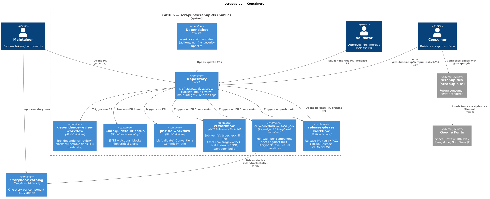
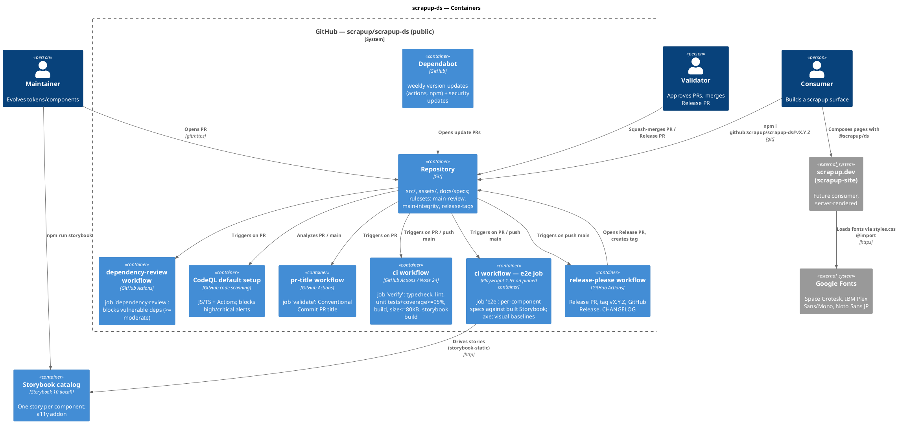
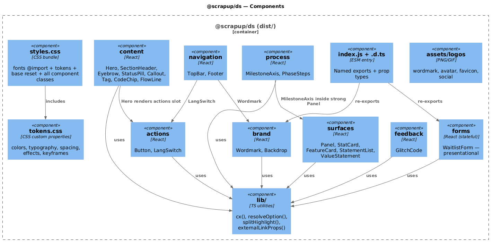
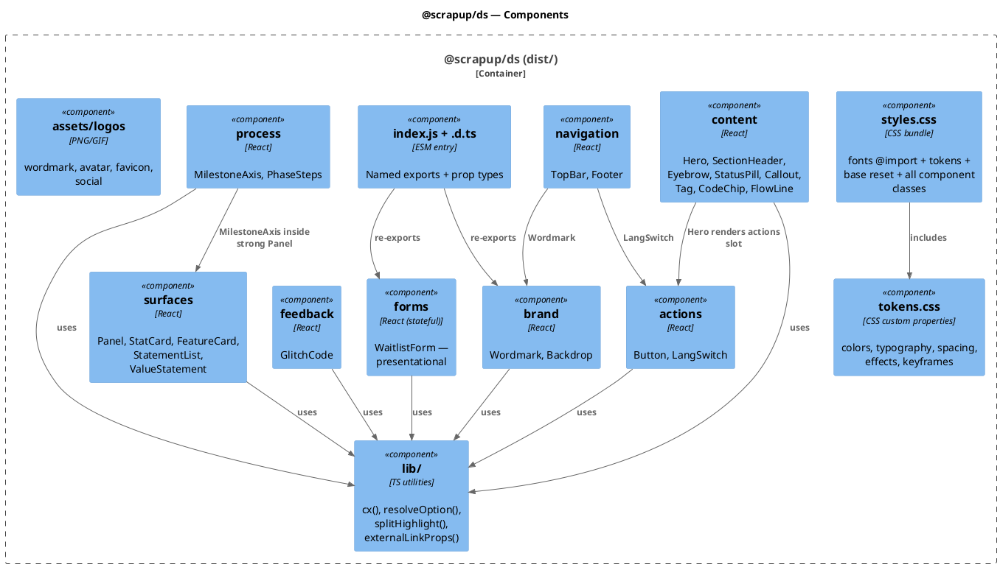
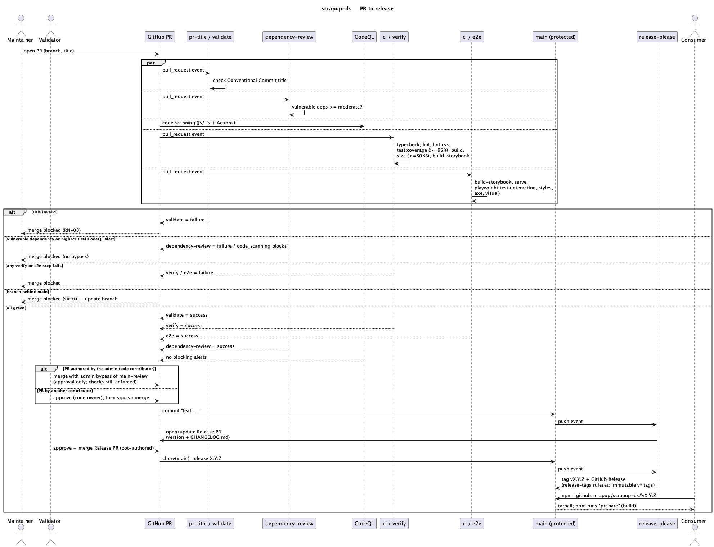
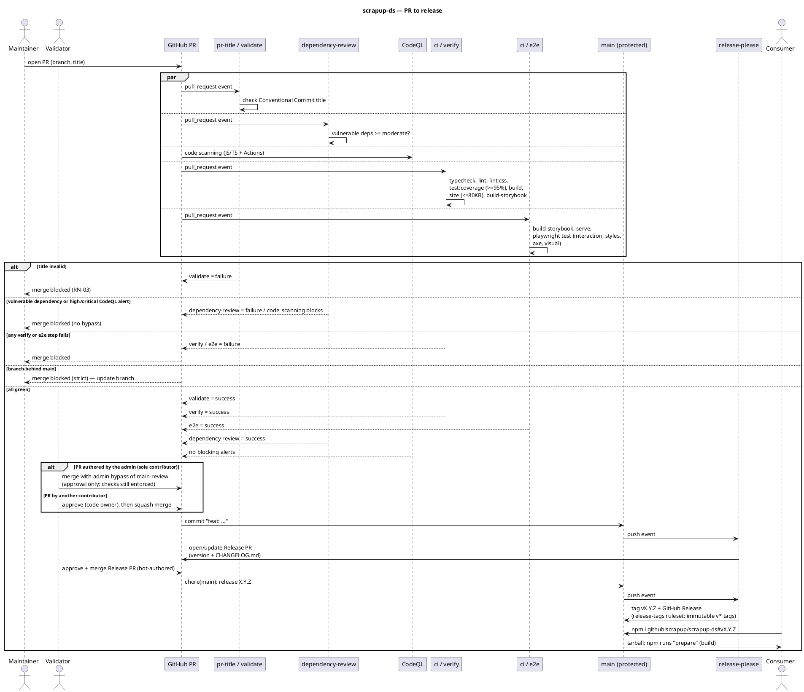

# Technical Plan: scrapup-ds (Design System Foundation)

> SDD Phase 2 — the How. Derives from the approved `spec.md` (RN-01..RN-23, OP-01..OP-03).
> Approved 2026-10-01; amended 2026-10-01 with the end-to-end test layer (Playwright, §5.4) and
> repository security hardening (rulesets, supply chain, scanning — §4.3, §5.2).
> Visual source of truth: claude.ai/design project `f3b2dbb9-52a7-4956-895a-3f8a26729c47`
> (`tokens/*.css`, `components/**/*.{jsx,d.ts}`, `assets/logos/*`).

## 1. Architecture Overview

- **Main decision:** a new public repository `scrapup/scrapup-ds` holding a single ESM React 19
  component library + CSS token layer, consumed by Git tag (no registry), with a local Storybook
  catalog. Governance cloned from `scrapup/scrapup` (branch protection, PR-title check,
  release-please).
- **Approach:** CSS-first. Tokens are CSS custom properties (ported 1:1 from the design project);
  components are thin, mostly stateless React function components that only map props to
  `su-`-prefixed BEM classes. All visual states (hover, variants, glow, animation) live in CSS, so
  static components render server-side with zero client behavior (RN-08). Only `LangSwitch`
  (callback) and `WaitlistForm` (local state) carry interactivity.
- **Affected repositories:** `scrapup/scrapup-ds` (new). No change to existing repos in this scope.

### 1.1 Stack (pinned at plan time, 2026-10-01)

| Concern | Choice | Version |
|---|---|---|
| UI runtime | React / React DOM (peer) | `^19.0.0` (dev: 19.3.0 — latest) |
| Language | TypeScript, `strict` | 6.0.3 (see D-01) |
| Build | Vite library mode (ESM only) + `tsc` for `.d.ts` | Vite 8.3.2, `@vitejs/plugin-react` 6.1.1 |
| Catalog | Storybook (`@storybook/react-vite`) + `@storybook/addon-a11y` | 10.6.1 |
| Unit tests | Vitest + `@vitest/coverage-v8` + jsdom + Testing Library + `axe-core` | 5.0.3 / 30.1.1 / 16.3.3 / 4.13.0 |
| E2E tests | `@playwright/test` (Chromium) + `@axe-core/playwright`, against the built Storybook served by `http-server`; CI on `mcr.microsoft.com/playwright:v1.63.0-noble` | 1.63.0 / 4.13.0 / 14.1.1 |
| Lint | ESLint 10 + `typescript-eslint` (React rules as `no-restricted-syntax` selectors — `eslint-plugin-react` 7.37.5 peers ESLint ≤ 9); Stylelint 17 + `stylelint-config-standard` | 10.11.0 / 8.71.0 / 17.16.0 / 40.0.0 |
| Runtime / CI | Node 24, GitHub Actions | — |
| Release | `googleapis/release-please-action@v4` (`release-type: node`) | v4 |

## 2. Solution Diagrams

### 2.1 C4 — Level 2 (Containers)



<details>
<summary>PlantUML source (<code>diagrams/c4-containers.puml</code>)</summary>



</details>

### 2.2 C4 — Level 3 (Components of the package)



<details>
<summary>PlantUML source (<code>diagrams/c4-components.puml</code>)</summary>



</details>

### 2.3 Sequence — change to release (success and failure)



<details>
<summary>PlantUML source (<code>diagrams/seq-release.puml</code>)</summary>



</details>

> Envelope/traceability diagram: not applicable (no messaging).

## 3. Data Modeling — Tokens, Assets and Repository Layout

No database. The "data" of this system is the token set and the component contracts.

### 3.1 Repository layout

```
scrapup-ds/
├── .github/
│   ├── CODEOWNERS                    # * @scrapup/scrapup
│   ├── PULL_REQUEST_TEMPLATE.md
│   ├── dependabot.yml
│   └── workflows/{pr-title,dependency-review,ci,release-please}.yml
├── SECURITY.md
├── .storybook/{main.ts,preview.ts}
├── assets/logos/                     # 7 files from the design project (RN-12)
├── e2e/                              # Playwright specs: <group>/<Name>.spec.ts, foundations/, support/
├── docs/specs/design-system-foundation/{spec,plan,tasks}.md + diagrams/{*.puml,*.png}
├── scripts/size-check.mjs            # RN-OP-01 budget gate
├── src/
│   ├── tokens/{fonts,colors,typography,spacing,effects,base}.css
│   ├── tokens.css                    # tokens only (no reset, no fonts)
│   ├── styles.css                    # fonts @import first, tokens, base, components
│   ├── lib/{cx,resolveOption,splitHighlight,externalLinkProps}.ts
│   ├── components/<group>/<Name>/{<Name>.tsx,<Name>.css,<Name>.stories.tsx,<Name>.test.tsx,index.ts}
│   └── index.ts
├── test/{setup.ts,a11y.ts,fixtures/design-tokens.json,tokens.test.ts,catalog.test.ts}
├── CHANGELOG.md (release-please) · LICENSE (MIT © 2026 scrapup) · CLAUDE.md · CONTRIBUTING.md
├── README.md · README.pt.md · README.ja.md
├── release-please-config.json · .release-please-manifest.json ({".": "0.0.0"})
├── eslint.config.js · stylelint.config.js · tsconfig.json · tsconfig.build.json · playwright.config.ts
├── vite.config.ts · vitest.config.ts · package.json · package-lock.json
```

### 3.2 Token model

Ported 1:1 from `tokens/*.css` (colors, typography, spacing, effects, base, fonts). Additions and
deviations:

| Change | Reason |
|---|---|
| New tokens for every literal that components used inline: e.g. `--su-cyan-wash: rgba(53,230,224,.08)`, `--su-cyan-outline: rgba(53,230,224,.4)`, `--su-placeholder: rgba(184,190,204,.34)`, `--glow-button-form`, `--shadow-success` | RN-07: components reference tokens only; literals live only in `src/tokens/` |
| **Remove** `@media (prefers-reduced-motion: reduce) { --flicker-duration: 0s }` | OP-03: animations stay on; opt-out is a component prop (RN-18) |
| Keyframes `scrapupFlicker`, `scrapupGlitchC/M/Slice` kept in `effects.css` | Brand motion |
| Component text inks below WCAG AA raised to the minimum passing value (decided 2026-10-02): Footer meta/author `--su-fg-7` (3.21:1) → `--su-fg-6` (5.40:1); CodeChip hint `.45` (3.12:1) and FlowLine `.55` (4.13:1) → `rgba(190,200,220,.6)` (4.70:1). Ported tokens unchanged; logotype text stays exempt (WCAG 1.4.3) | Zero critical/serious axe gate (spec §5) |
| Package-added tokens live in `src/tokens/extensions.css`; ported files stay 1:1 with the design project | Parity fixture stays exact |
| Accent override applies on `:root` (verified in e2e, TF-83-01): `--glow-*`/`--shadow-*` are declared on `:root` and resolve `var(--accent)` there, so a subtree override re-tints `--accent` itself but not the derived tokens | Documented in README; consumers theme with `:root { --accent: … }` |

Token parity is guarded by `test/fixtures/design-tokens.json` (name → value, exported from the
design project at import time) and `test/tokens.test.ts` (parses `src/tokens/*.css`, asserts every
fixture token exists with the same value; extra tokens allowed).

### 3.3 Component contracts (public API)

Source: design project `*.d.ts`. Global deviations (apply to all components):

| ID | Deviation from source | Reason |
|---|---|---|
| D-02 | `style?: CSSProperties` prop **replaced** by `className?: string` (appended to root) | RN-08 — no inline styles |
| D-03 | Numeric/free-form sizing props become enums mapped to classes | RN-08 |
| D-04 | Hover via `useState` replaced by CSS `:hover` / `:focus-visible` | RN-08, server-render friendly |
| D-05 | Unknown enum value → documented default via `resolveOption()` | Spec §4 |
| D-06 | External links (`http(s)://`) get `target="_blank" rel="noopener noreferrer"` | Spec §4 |
| D-07 | Empty optional slots render nothing (no empty wrappers) | Spec §4 |

Per-component contract (defaults in **bold**):

| Component | Props |
|---|---|
| Wordmark | `size?: 'xs'(11.5px) \| 'sm'(22px) \| **'md'(24px)** \| 'xl'(66px)`; `tone?: **'dark'** \| 'light'`; `flicker?: boolean` (**true**; RN-18); `href?`; `className?` |
| Backdrop | `label?`; `site?` (**"SCRAPUP.DEV"**); `marks?` (**true**); `scanlines?` (**true**); `fullHeight?` (false — replaces `style={{minHeight:'100vh'}}`); `children`; `className?` |
| Button | `variant?: **'primary'** \| 'secondary' \| 'link'`; `size?: **'md'** \| 'sm'`; `icon?`; `href?` (→ `<a>`) ; `onClick?`; `type?: **'button'** \| 'submit'`; `children`; `aria-label?` (icon-only buttons); `disabled?`; `className?` |
| LangSwitch | `value?` (**'EN'**); `options?` (**['EN','PT','JA']**); `onChange?(lang)`; `label?` (**'Language'**, group accessible name); buttons with `aria-pressed` |
| TopBar | `tagline?`; `links?: {label, href?, onClick?}[]`; `active?`; `lang?`; `onLang?` (omit → no switch); `repo?`; `repoHref?`; `homeHref?` |
| Footer | `items?: string[]`; `links?: {label, href?, onClick?}[]`; `author?` |
| Hero | `status?`; `kicker?`; `title` (required); `highlight?`; `lead?`; `callout?`; `actions?` |
| SectionHeader | `index?`; `eyebrow?`; `title` (required); `highlight?`; `body?`; `size?: **'md'** \| 'xl'`; `bar?` |
| Eyebrow | `index?`; `tone?: **'cyan'** \| 'neon' \| 'muted'`; `children`; `className?` |
| StatusPill | `children`; `dot?` (**true**) |
| Callout | `children`; `size?: **'sm'** \| 'lg'` |
| Tag | `children`; `tone?: **'cyan'** \| 'quiet' \| 'neon'` |
| CodeChip | `children`; `hint?` |
| FlowLine | `steps?` (**['scrap','forge','forged delivery']**) |
| Panel | `variant?: **'default'** \| 'strong' \| 'edge' \| 'dashed'`; `accentEdge?: 'neon' \| 'cyan'`; `padding?: **'md'(24)** \| 'lg'(28) \| 'xl'(32) \| 'xxl'(42)`; `as?: 'div' \| 'section' \| 'article'`; `children`; `className?` |
| StatCard | `value?`; `title?`; `body` (required); `source?`; `tone?: **'neon'** \| 'cyan'` |
| FeatureCard | `index?`; `label?`; `title` (required); `body?`; `accentEdge?`; `labelTone?: **'neon'** \| 'cyan'` |
| StatementList | `items: ReactNode[]` (empty → renders nothing) |
| ValueStatement | `pairs: [string, string][]`; `note?` |
| MilestoneAxis | `title?`; `meta?`; `milestones: {code, phase, body?, current?}[]`; `currentLabel?` |
| PhaseSteps | `steps: {title, body?}[]` |
| WaitlistForm | see §4.2 |
| GlitchCode | `children`; `size?: **'lg'** \| 'md'`; `animated?` (**true**; RN-18 — new prop) |

Exact pixel values, spacing and tracking per component are ported from each source `.jsx` into the
component `.css`, using tokens.

## 4. Integration Contracts

### 4.1 Package contract (`package.json`)

```json
{
  "name": "@scrapup/ds",
  "version": "0.0.0",
  "private": true,
  "type": "module",
  "license": "MIT",
  "engines": { "node": ">=24" },
  "sideEffects": ["**/*.css"],
  "files": ["dist", "assets"],
  "exports": {
    ".": { "types": "./dist/index.d.ts", "import": "./dist/index.js" },
    "./styles.css": "./dist/styles.css",
    "./tokens.css": "./dist/tokens.css",
    "./assets/*": "./assets/*"
  },
  "peerDependencies": { "react": "^19.0.0", "react-dom": "^19.0.0" },
  "scripts": {
    "build": "vite build && tsc -p tsconfig.build.json",
    "prepare": "npm run build",
    "typecheck": "tsc --noEmit",
    "lint": "eslint .",
    "lint:css": "stylelint \"src/**/*.css\"",
    "test": "vitest run",
    "test:coverage": "vitest run --coverage",
    "test:e2e": "playwright test",
    "test:e2e:update": "playwright test --update-snapshots",
    "size": "node scripts/size-check.mjs",
    "storybook": "storybook dev -p 6006",
    "build-storybook": "storybook build"
  }
}
```

- `"private": true` blocks accidental registry publication (RN-05) and does not prevent Git
  installs.
- Consumer install: `npm i github:scrapup/scrapup-ds#v0.1.0`; npm installs devDependencies and runs
  `prepare` (build) for Git dependencies.
- Consumer usage:

```tsx
import '@scrapup/ds/styles.css';            // once, at the app root
import { Button, Hero } from '@scrapup/ds';
```

- Build: Vite library mode, ESM, `react`/`react-dom`/`react/jsx-runtime` external, minified,
  `cssCodeSplit: false` → single `dist/styles.css`; `src/tokens.css` emitted as `dist/tokens.css`.
  The Google Fonts `@import` must remain the first rule of `dist/styles.css` (asserted in TF).

### 4.2 WaitlistForm contract (RN-13)

```ts
export type WaitlistStatus = 'idle' | 'submitting' | 'success' | 'error';
export interface WaitlistFormProps {
  label?: string;          // visually hidden input label — default 'E-mail address'
  placeholder?: string;    // 'you@domain.dev'
  cta?: string;            // 'JOIN THE WAITLIST ↗'
  note?: string;           // 'No spam — one message when access opens.'
  successTitle?: string;   // "You're on the list."
  successBody?: string;    // "We'll reach out at first access. Forging the public release."
  invalidMessage?: string; // 'Enter a valid e-mail address.'
  errorMessage?: string;   // 'Something went wrong. Try again.'
  onSubmit?: (email: string) => void | Promise<void>;
  status?: WaitlistStatus; // controlled override (replaces source `submitted`)
  className?: string;
}
```

| Input | Behavior |
|---|---|
| empty / not matching `/^[^\s@]+@[^\s@]+\.[^\s@]+$/` after trim | `invalidMessage` shown (`role="alert"`), `onSubmit` not called |
| valid, `onSubmit` sync or resolves | `success` state; no network, storage or logging inside the component |
| `onSubmit` rejects/throws | `error` state, `errorMessage` shown, value preserved, resubmittable |
| submit while `submitting` | ignored; button `aria-busy`/`disabled` |
| `status` prop set | overrides internal state |

### 4.3 GitHub repository contract

Order of operations: **create + configure** (no branch needed) → **bootstrap commit** (creates
`main`) → **rulesets step 1** → (after `ci.yml` merges and CodeQL's first analysis) **rulesets
step 2**. A required check that never reports would block every merge, hence the two steps.

#### 4.3.1 Creation and settings

```bash
gh repo create scrapup/scrapup-ds --public \
  --description "scrapup design system — tokens, brand assets and React components."

# General + merge (mirror scrapup/scrapup)
gh api -X PATCH repos/scrapup/scrapup-ds \
  -F has_issues=true -F has_projects=true -F has_wiki=false -F has_discussions=false \
  -F allow_squash_merge=true -F allow_merge_commit=false -F allow_rebase_merge=false \
  -f squash_merge_commit_title=PR_TITLE -f squash_merge_commit_message=COMMIT_MESSAGES \
  -F allow_auto_merge=false -F allow_update_branch=false -F delete_branch_on_merge=false \
  -F web_commit_signoff_required=false

# Actions — least privilege (RN-21): read-only default token; PR creation allowed for release-please
gh api -X PUT repos/scrapup/scrapup-ds/actions/permissions/workflow \
  -f default_workflow_permissions=read -F can_approve_pull_request_reviews=true

# Actions — allowlist (RN-21)
gh api -X PUT repos/scrapup/scrapup-ds/actions/permissions \
  -F enabled=true -f allowed_actions=selected
gh api -X PUT repos/scrapup/scrapup-ds/actions/permissions/selected-actions --input - <<'JSON'
{ "github_owned_allowed": true, "verified_allowed": false,
  "patterns_allowed": [ "amannn/action-semantic-pull-request@*", "googleapis/release-please-action@*" ] }
JSON

# Security (RN-19, RN-22, RN-23)
gh api -X PUT repos/scrapup/scrapup-ds/vulnerability-alerts
gh api -X PUT repos/scrapup/scrapup-ds/automated-security-fixes        # Dependabot security updates
gh api -X PUT repos/scrapup/scrapup-ds/private-vulnerability-reporting
gh api -X PATCH repos/scrapup/scrapup-ds --input - <<'JSON'
{ "security_and_analysis": {
    "secret_scanning": { "status": "enabled" },
    "secret_scanning_push_protection": { "status": "enabled" } } }
JSON
```

Deviations from `scrapup/scrapup` (all approved): read-only default token, actions allowlist,
secret scanning + push protection, Dependabot security updates, private vulnerability reporting.
`github_owned_allowed` covers `actions/checkout`, `actions/setup-node`, `actions/upload-artifact`,
`actions/dependency-review-action` and CodeQL default setup.

#### 4.3.2 Rulesets (replace classic branch protection)

GitHub does not let a PR author approve their own PR. To require one approval while the admin (sole
contributor) can still merge their own PRs, `main` is governed by **two layered rulesets** (the most
restrictive combination applies):

| Ruleset | Target | Rules | Bypass |
|---|---|---|---|
| `main-review` | `~DEFAULT_BRANCH` | `pull_request`: 1 approval, code-owner review, dismiss stale approvals on push, conversation resolution, merge method `squash` | **Repository admin, `pull_request` mode** (bypass only when merging a PR; never on direct push) |
| `main-integrity` | `~DEFAULT_BRANCH` | `pull_request` (0 approvals — forbids direct push), `required_status_checks` (strict), `required_linear_history`, `non_fast_forward`, `deletion`; step 2 adds `code_scanning` | **None** — checks apply to everyone, admin included |
| `release-tags` | `refs/tags/v*` | `update`, `deletion` | **None** — tags are immutable; creation is left open because GitHub rejects the Actions app (15368) as a repository ruleset bypass actor, so release-please (`GITHUB_TOKEN`) could not create tags otherwise. Manual tag creation is forbidden by process (RN-20) |

Release PRs are authored by `github-actions[bot]`, so the admin approves them normally (no bypass).
Evidence 2026-10-01: Release PRs in `scrapup-site`, `hermetic-diagrams` and `scrapup` ran all
required checks.

```json
POST repos/scrapup/scrapup-ds/rulesets   — main-review
{ "name": "main-review", "target": "branch", "enforcement": "active",
  "conditions": { "ref_name": { "include": ["~DEFAULT_BRANCH"], "exclude": [] } },
  "bypass_actors": [ { "actor_id": 5, "actor_type": "RepositoryRole", "bypass_mode": "pull_request" } ],
  "rules": [ { "type": "pull_request", "parameters": {
      "required_approving_review_count": 1, "require_code_owner_review": true,
      "dismiss_stale_reviews_on_push": true, "require_last_push_approval": false,
      "required_review_thread_resolution": true, "allowed_merge_methods": ["squash"] } } ] }
```

```json
POST repos/scrapup/scrapup-ds/rulesets   — main-integrity (step 1)
{ "name": "main-integrity", "target": "branch", "enforcement": "active",
  "conditions": { "ref_name": { "include": ["~DEFAULT_BRANCH"], "exclude": [] } },
  "bypass_actors": [],
  "rules": [
    { "type": "deletion" }, { "type": "non_fast_forward" }, { "type": "required_linear_history" },
    { "type": "pull_request", "parameters": { "required_approving_review_count": 0,
        "require_code_owner_review": false, "dismiss_stale_reviews_on_push": false,
        "require_last_push_approval": false, "required_review_thread_resolution": false,
        "allowed_merge_methods": ["squash"] } },
    { "type": "required_status_checks", "parameters": { "strict_required_status_checks_policy": true,
        "required_status_checks": [
          { "context": "validate", "integration_id": 15368 },
          { "context": "dependency-review", "integration_id": 15368 } ] } } ] }
```

Step 2 (`PUT repos/scrapup/scrapup-ds/rulesets/<id>`): adds `verify` and `e2e` to
`required_status_checks` and the rule
`{ "type": "code_scanning", "parameters": { "code_scanning_tools": [ { "tool": "CodeQL",
"security_alerts_threshold": "high_or_higher", "alerts_threshold": "errors" } ] } }`.

```json
POST repos/scrapup/scrapup-ds/rulesets   — release-tags
{ "name": "release-tags", "target": "tag", "enforcement": "active",
  "conditions": { "ref_name": { "include": ["refs/tags/v*"], "exclude": [] } },
  "bypass_actors": [],
  "rules": [ { "type": "update" }, { "type": "deletion" } ] }
```

(`actor_id` 5 = repository role *admin*; 15368 = GitHub Actions app, used as `integration_id` of required checks. Verified 2026-10-02: `POST rulesets` with `Integration` 15368 as bypass actor returns 422 "Actor GitHub Actions integration must be part of the ruleset source or owner organization".)

#### 4.3.3 Code scanning (RN-22)

CodeQL **default setup** enabled after TF-82-01 merges (JS/TS code and workflows exist):

```bash
gh api -X PATCH repos/scrapup/scrapup-ds/code-scanning/default-setup \
  -f state=configured -f query_suite=default -f 'languages[]=javascript-typescript' -f 'languages[]=actions'
```

The `code_scanning` ruleset rule is added only after the first analysis on `main` completes.

#### 4.3.4 Workflows and automation files

All `uses:` are pinned to a **full commit SHA** with the version in a trailing comment
(`uses: actions/checkout@<sha> # v4.x.y`); each job declares explicit `permissions` (RN-21).

| File | Trigger | Job (= required context) | Content |
|---|---|---|---|
| `pr-title.yml` | `pull_request` opened/edited/synchronize/reopened | `validate` | `amannn/action-semantic-pull-request` (v5, SHA-pinned), types per RN-03; `permissions: pull-requests: read` |
| `dependency-review.yml` | `pull_request` | `dependency-review` | `actions/dependency-review-action` (v4, SHA-pinned), `fail-on-severity: moderate`, `comment-summary-in-pr: on-failure`; `permissions: contents: read, pull-requests: write` |
| `ci.yml` | `pull_request`, `push: main` | `verify` | Node from `.nvmrc`, `npm ci` → `typecheck` → `lint` → `lint:css` → `test:coverage` → `build` → build-output contract (`REQUIRE_DIST=1`) → `size` → `build-storybook`; size + coverage summary to `$GITHUB_STEP_SUMMARY`; `permissions: contents: read` |
| `ci.yml` | `pull_request`, `push: main` | `e2e` | Container `mcr.microsoft.com/playwright:v1.63.0-noble` pinned by digest (`HOME=/root`), Node from `.nvmrc`, `npm ci` → image/`@playwright/test` version parity → `build-storybook` → `test:e2e`; uploads `playwright-report/` + `test-results/` (7 days); `permissions: contents: read`. Visual assertions run only on the container (`CI` or `RUN_VISUAL=1`) |
| `release-please.yml` | `push: main` | `release-please` | `googleapis/release-please-action` (v4, SHA-pinned) with config/manifest files; `permissions: contents: write, pull-requests: write`; no deploy/publish steps (RN-05, RN-14) |
| `.github/dependabot.yml` | weekly (Monday) | — | Version updates for `github-actions` (`/`) and `npm` (`/`, grouped: `storybook*`, `@vitest/*`+`vitest`, `@playwright/test`+container tag noted in PR, `eslint*`/`typescript-eslint`, `stylelint*`); `commit-message.prefix: chore(deps)` / `build(deps)` for runtime-relevant; `open-pull-requests-limit: 5`; TypeScript major updates ignored (D-01) |
| `SECURITY.md` | — | — | Supported versions (latest minor), private vulnerability reporting link, no public issues for vulnerabilities, expected response time `[best effort]` |

`release-please-config.json`: same as `scrapup-site` (`release-type: node`,
`include-component-in-tag: false`, `bump-minor-pre-major: true`,
`bump-patch-for-minor-pre-major: false`, `changelog-path: CHANGELOG.md`) plus `extra-files` generic
markers in `README*.md` for the install tag (`#vX.Y.Z` — `x-release-please-version`). Manifest
starts at `0.0.0`; the first `feat` yields `v0.1.0`.

## 5. Resilience, Security and Error Handling

### 5.1 Failure matrix

| Component | Failure | Strategy | User impact |
|---|---|---|---|
| Google Fonts | Unreachable/blocked | `display=swap` + fallback stacks in tokens (RN-11) | Fallback typography |
| Consumer CSS | `styles.css` not imported | README documents the import; components emit semantic HTML | Unstyled but readable |
| Component props | Unknown enum | `resolveOption()` → default (D-05) | None |
| Component props | Missing optional slot | Slot omitted (D-07) | None |
| WaitlistForm handler | Rejects | `error` state, value preserved (§4.2) | Retry possible |
| Git install | `prepare` build fails on consumer | `verify` builds the same lockfile on every PR; tag only after green `main` | Install fails loudly |
| CI | Required check missing (e.g. renamed job) | Job names `validate`/`dependency-review`/`verify`/`e2e` are frozen; rename requires a ruleset update in the same PR | Merges blocked until fixed |
| Rulesets | Release PR lacks checks (workflows not triggered for bot PRs) | Close/reopen the Release PR to trigger `pull_request`; checks are never bypassed | Release delayed |
| Rulesets | `release-tags` blocks release-please tag creation | Ruleset must not contain `creation`; fix ruleset — never create tags by hand | Release delayed |
| CodeQL | High/critical alert on PR | Merge blocked by `code_scanning` rule; fix or dismiss with justification | PR blocked |
| Dependency review | Vulnerable dependency (≥ moderate) | PR blocked; pin/override or wait for fix | PR blocked |
| Dependabot | Update breaks build/e2e | PR stays red; never merged without green checks | None |
| Actions allowlist | New third-party action needed | Add pattern to allowlist in the same change (reviewed) | Workflow fails until allowed |
| E2E | Flaky run | `retries: 2` on CI, trace on first retry, `forbidOnly`; fonts requests aborted for determinism (§5.5) | Retry; report artifact |
| E2E | Visual diff after intentional change | Baselines regenerated **only** on the pinned container (`test:e2e:update`) and committed in the same PR | Reviewed diff |
| release-please | No releasable commits | No Release PR (expected) | None |

### 5.2 Security

- No `dangerouslySetInnerHTML`; all text rendered as React children (ESLint
  `no-restricted-syntax` on `JSXAttribute[name.name="dangerouslySetInnerHTML"]`).
- External links: `rel="noopener noreferrer"` (D-06).
- WaitlistForm performs no I/O; data handling is the consumer's responsibility (RN-13).
- Supply chain (RN-21): committed `package-lock.json`, `npm ci` in CI, actions pinned to full
  commit SHAs, actions allowlist, read-only default token with explicit per-job `permissions`,
  Dependabot version updates (weekly) and security updates.
- Review (RN-02): two layered rulesets — 1 code-owner approval with admin bypass only at PR merge;
  required checks, code scanning, linear history, no force-push/deletion with **no** bypass.
- Release integrity (RN-20): `release-tags` ruleset — `v*` tags can never be moved or deleted;
  creation only by release-please (process rule; platform limitation, §4.3.2).
- Scanning (RN-22): dependency review blocks PRs with vulnerable dependencies (≥ moderate); CodeQL
  (JS/TS + Actions) blocks merges on high/critical security alerts or errors.
- Disclosure (RN-23): private vulnerability reporting + `SECURITY.md`.
- Public repo: no secrets required by any workflow (no publish/deploy).
- Secret scanning + push protection enabled (RN-19): pushes with detectable secrets are blocked;
  bypass only through GitHub's push-protection bypass flow, never by disabling the setting.

### 5.3 Static enforcement of brand rules

| Rule | Mechanism |
|---|---|
| RN-08 no inline styles | ESLint `no-restricted-syntax` on `JSXAttribute[name.name="style"]` (DOM and component props) |
| RN-07 tokens only | Stylelint outside `src/tokens/**`: `color-no-hex`, `color-named: never`, `function-disallowed-list: [rgb, rgba, hsl, hsla]` |
| RN-10 square corners | Stylelint `declaration-property-value-allowed-list` — `border-radius` only `0` or `var(--radius-*)` |
| No `any` | `@typescript-eslint/no-explicit-any: error` |
| No console output | `no-console: error` |
| RN-06 catalog completeness | `test/catalog.test.ts`: the 23 names are exported from `src/index.ts` and each has a `.stories.tsx` |
| OP-01 size ≤ 80 KB | `scripts/size-check.mjs`: sum of `dist/**/*.{js,css}` (minified, uncompressed; `.d.ts`, fonts, assets excluded) ≤ 81 920 bytes, else exit 1 |
| OP-02 coverage ≥ 95% | Vitest `coverage.thresholds` 95 for lines/branches/functions/statements over `src/components/**` and `src/lib/**` (stories excluded) |
| a11y | Unit: `test/a11y.ts` (`axe-core` in jsdom). E2E: `@axe-core/playwright` per story in Chromium. Zero `critical`/`serious` in both; Storybook a11y addon for manual review |
| RN-06 e2e completeness | `test/catalog.test.ts` also asserts each of the 23 components has `e2e/<group>/<Name>.spec.ts` |

### 5.4 Test strategy

| Layer | Tool / environment | Scope per component | Gate |
|---|---|---|---|
| Unit | Vitest + Testing Library, jsdom | Rendering, props → classes, defaults/fallbacks (D-05), empty slots (D-07), link attributes (D-06), state logic (WaitlistForm), axe in jsdom | `verify`; coverage ≥ 95% |
| E2E | Playwright (Chromium) against `storybook-static` served on `:6007`; each spec opens `iframe.html?id=<story-id>&viewMode=story` | Real-browser behavior: hover/focus-visible states (computed styles), keyboard (Tab/Enter/Space), WaitlistForm flows (invalid, success, error, double submit), animation on/off (`animation-name`), accent re-tint (override `--accent`, assert computed color), square corners (`border-radius: 0px`), external links, `@axe-core/playwright`, `toHaveScreenshot` per story | `e2e`; required |

E2E conventions:
- `playwright.config.ts`: `testDir: 'e2e'`, single `chromium` project, viewport 1280×800,
  `deviceScaleFactor: 1`, `fullyParallel`, `forbidOnly`/`retries: 2` on CI, `trace: on-first-retry`,
  snapshots in `e2e/__screenshots__/{testFileName}/{arg}{ext}`, `toHaveScreenshot` with
  `animations: 'disabled'` and `maxDiffPixelRatio: 0.01`; `webServer`:
  `npx http-server storybook-static -p 6007 -s` (reuse locally, fresh on CI). Mirrors
  `scrapup-site/playwright.config.ts`.
- `e2e/support/story.ts`: `gotoStory(page, id, args?)` builds the iframe URL (args via `&args=`),
  aborts `fonts.googleapis.com`/`fonts.gstatic.com` requests, waits for `#storybook-root` content;
  `expectNoA11yViolations(page)` wraps `AxeBuilder`.
- WaitlistForm handler outcomes are driven by story args (`outcome: 'resolve' | 'reject'`) defined in
  its stories; no network in tests.
- Foundations: `src/foundations/Tokens.stories.tsx` (swatches/type/spacing) exercised by
  `e2e/foundations/tokens.spec.ts` (accent re-tint, fallback font family when fonts are blocked).
- Visual baselines are generated and updated only on the pinned container (as in `scrapup-site`).

### 5.5 Observability

Runtime telemetry is not applicable — a UI library emits no logs, metrics or traces (`no-console`).
Delivery observability lives in CI: `verify` writes the size report (bytes vs. budget) and the
coverage summary to the job summary; release-please records versions and `CHANGELOG.md`.

## 6. Rationale and Trade-offs

| Decision | Discarded alternative | Rationale |
|---|---|---|
| D-01 TypeScript **6.0.3** | TypeScript 7.0.2 (latest) | `typescript-eslint` 8.71.0 peer range is `>=4.8.4 <6.1.0`; TS 7 breaks the lint gate. Revisit when typescript-eslint supports 7 |
| Plain `su-` BEM classes in global CSS | CSS Modules / CSS-in-JS | Server-render friendly, zero runtime, classes reusable by non-React surfaces (e.g. Astro) and stable for consumers |
| Single `styles.css` bundle + separate `tokens.css` | Per-component CSS imports | Git consumers and SSR frameworks import one file; `tokens.css` for token-only use |
| Git-only with `prepare` build | Committing `dist/` | No build artifacts in history; cost: consumers install devDeps once at install time |
| `"private": true` | Registry publish | RN-05 |
| `className` instead of `style` | Keep `style` | RN-08; consumers extend via classes |
| Rulesets in two steps (`validate` + `dependency-review`, then `verify` + `e2e` + code scanning) | Require all at bootstrap | A required check that never reports blocks every merge |
| Two layered rulesets for `main` (review with admin PR bypass; integrity without bypass) | Classic protection with `enforce_admins: false` | Classic admin bypass skips **all** rules, checks included; rulesets let the admin skip only the approval, and only at PR merge |
| 1 required approval + admin bypass | 0 approvals (as `scrapup/scrapup`) | Any future contributor needs the owner's approval; the sole contributor is not blocked |
| Actions pinned by SHA + Dependabot | Major tags (as sibling repos) | Immutable references against tag hijacking; Dependabot keeps SHAs current |
| `fail-on-severity: moderate` (dependency review), CodeQL `high_or_higher` | Stricter (`low`) / looser thresholds | Blocks meaningful risk without noise from low findings |
| Bootstrap commit pushed directly to `main` before rulesets | Everything via PR | Rulesets need an existing `main`; bootstrap contains only governance files + specs |
| No `'use client'` directives | Directives on LangSwitch/WaitlistForm | Bundler strips module-level directives in library mode; RSC consumers wrap the two interactive components. Revisit if an RSC consumer appears |
| Storybook local only | Hosted (Chromatic/Pages) | RN-14; `build-storybook` in CI keeps the catalog compiling |
| E2E against built Storybook stories | `@playwright/experimental-ct-react` (component testing) | Stories already exist per variant (single source for catalog and tests); CT is still experimental; served static build mirrors the site's "test the built artifact" approach |
| Separate `e2e` job on the pinned Playwright container | E2E steps inside `verify` | Deterministic browser/fonts for visual baselines (same practice as `scrapup-site`); parallel with `verify` |
| Google Fonts requests aborted in E2E | Load real fonts | Network-independent, deterministic snapshots; also exercises the fallback edge case. Cost: visual baselines use fallback fonts; brand fonts reviewed manually in Storybook |
