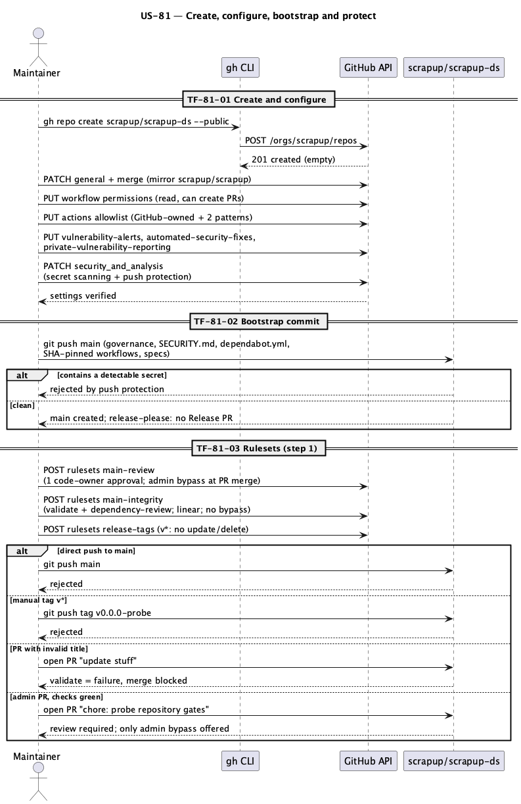
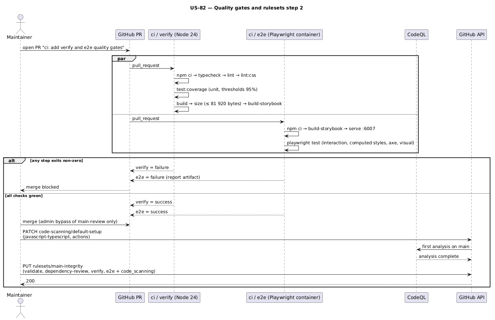
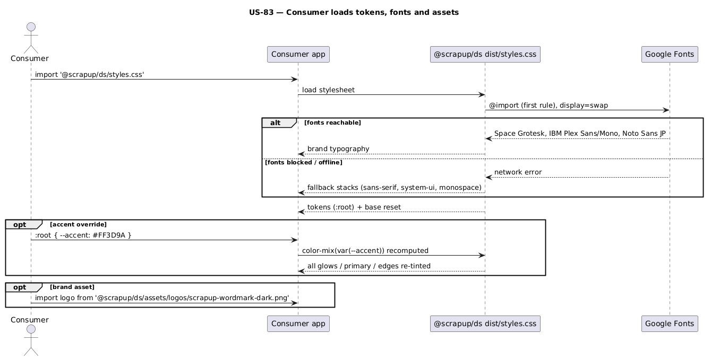
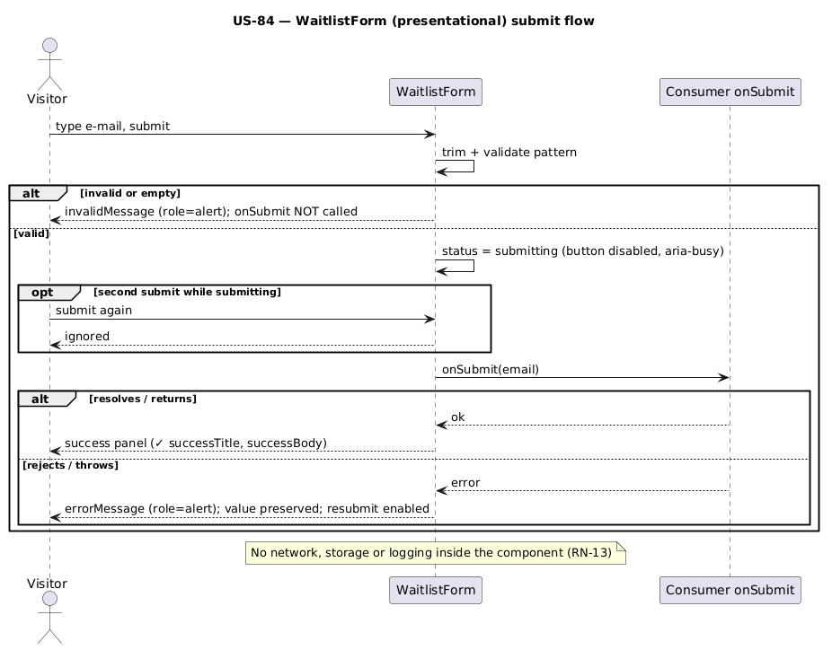

# Execution Backlog: scrapup-ds (Design System Foundation)

> SDD Phase 3. Prerequisites: approved `spec.md` (2026-10-01) and approved `plan.md` (2026-10-01).
> Stack: React 19 (peer) + TypeScript 6.0.3 strict, Vite 8 library mode, Storybook 10 (local),
> Vitest 5 + Testing Library + axe-core (unit), Playwright 1.63 + @axe-core/playwright (e2e, against
> the built Storybook), ESLint 10 + Stylelint 17, Node 24, GitHub Actions.
> Amended 2026-10-01: unit + e2e test layers per component (plan §5.4).
> Visual source of truth: claude.ai/design project `f3b2dbb9-52a7-4956-895a-3f8a26729c47`.

## Reference Epic

**Epic:** E-00 — scrapup-ds (internal scrapup initiative; no PM epic). Macro context: `spec.md` +
`plan.md`.

---

## Traceability

| Requirement (spec.md) | Decision (plan.md) | User Story | Tasks |
|---|---|---|---|
| RN-01 | Public repo created and configured like `scrapup/scrapup` (§4.3) | US-81 | TF-81-01 |
| RN-19, RN-21, RN-23 | Secret scanning + push protection; read-only token; actions allowlist; Dependabot security updates; private reporting (§4.3.1) | US-81 | TF-81-01 |
| RN-21, RN-22, RN-23 | SHA-pinned actions with explicit permissions; Dependabot version updates; dependency review; `SECURITY.md` (§4.3.4) | US-81 | TF-81-02 |
| RN-02, RN-20 | Rulesets `main-review` (admin PR bypass), `main-integrity` (no bypass), `release-tags` (§4.3.2) | US-81, US-82 | TF-81-03, TF-82-02 |
| RN-22 | CodeQL default setup + `code_scanning` ruleset rule (§4.3.3) | US-82 | TF-82-02 |
| RN-01, RN-16, RN-17 | MIT, bootstrap commit, English artifacts (§4.3) | US-81 | TF-81-02 |
| RN-03 | Merge settings; `pr-title` job `validate` required (§4.3) | US-81 | TF-81-01, TF-81-02, TF-81-03 |
| RN-04 | Workflow permissions; release-please config/manifest `0.0.0` (§4.3) | US-81, US-85 | TF-81-01, TF-81-02, TF-85-02 |
| RN-08, RN-07, RN-10 | ESLint/Stylelint static enforcement (§5.3) | US-82 | TF-82-01 |
| OP-01 (≤ 80 KB), OP-02 (≥ 95%) | `size-check.mjs`, coverage thresholds, `ci / verify` (§5.3, §4.3) | US-82 | TF-82-01, TF-82-02 |
| Spec §5 unit + e2e tests | Test strategy: Vitest (unit) + Playwright vs. built Storybook (e2e), `ci / e2e` required (§5.4, §4.3) | US-82, US-83, US-84, US-86 | TF-82-01, TF-82-02, TF-83-01, TF-84-01, TF-84-02, TF-86-01, TF-86-02 |
| Spec §4 (defaults, empty slots, external links) | `lib/` utilities D-05..D-07 (§3.3) | US-82 | TF-82-01 |
| RN-07, RN-09, RN-11, OP-03 | Token model + parity fixture; reduced-motion rule removed (§3.2) | US-83 | TF-83-01 |
| RN-12 | `assets/logos` + `./assets/*` export (§4.1) | US-83 | TF-83-02 |
| RN-06, RN-08, RN-18 | 23 components, class-based, contracts §3.3 | US-84, US-86 | TF-84-01, TF-84-02, TF-86-01, TF-86-02 |
| RN-13 | WaitlistForm contract (§4.2) | US-86 | TF-86-02 |
| RN-14, RN-15 | Local Storybook, no screens (§1, §6) | US-82, US-84, US-86 | TF-82-01, TF-84-01, TF-84-02, TF-86-01, TF-86-02 |
| RN-05 | Git-only, `private: true`, `prepare` build (§4.1) | US-82, US-85 | TF-82-01, TF-85-02 |
| RN-16 (trilingual README) | README EN/PT/JA + release markers (§4.3) | US-85 | TF-85-01 |
| Success criteria §5 (tag `v0.1.0`, consumer install) | Release flow (§2.3) | US-85 | TF-85-02 |

Reference diagrams (reused across US): [`plan.md` §2](plan.md) — C4 N2, C4 N3, sequence PR → release.


---

## User Stories Overview

| # | User Story | Value Delivered | Depends on |
|---|---|---|---|
| US-81 | Governed and hardened public repository | `scrapup/scrapup-ds` exists, public, hardened (Actions, secrets, Dependabot, private reporting), with rulesets on `main` and `v*` tags | — |
| US-82 | Toolchain and quality gates | Every PR is proven by `verify` (types, lint, brand rules, unit tests ≥ 95%, build, size ≤ 80 KB, catalog build) and `e2e` (Playwright in a real browser) | US-81 |
| US-83 | Brand tokens and assets | Consumers get the exact brand tokens, fonts and logo assets from one stylesheet | US-82 |
| US-84 | Brand chrome and content primitives | 12 components (brand, actions, navigation, content primitives) usable, in the catalog, unit + e2e tested | US-83 |
| US-86 | Composite surfaces, process, form and feedback components | Remaining 11 components + catalog completeness (exactly 23), unit + e2e tested | US-84 |
| US-85 | Documentation and first release | `v0.1.0` tagged; a consumer installs it from Git following the README | US-86 |

**Execution note (all TFs after TF-81-03):** each TF is delivered as its own branch + PR with a
Conventional-Commit title; squash merge only. The owner's PRs are merged through the admin bypass of
`main-review` (approval only) after **all** required checks are green; Release PRs (bot-authored)
are approved and merged normally. No `Co-Authored-By` trailers (RN-17). Explicit,
file-by-file `git add`.

---

## US-81: Governed and hardened public repository

**Epic:** E-00 scrapup-ds
**System:** `scrapup/scrapup-ds`
**Estimate:** 5 Story Points
**Priority:** P0

### Value Narrative

> **As** the scrapup Validator,
> **I want** a public `scrapup/scrapup-ds` repository configured like `scrapup/scrapup` and hardened
> (rulesets, least-privilege automation, supply-chain and secret controls),
> **So that** every design-system change enters `main` only through a titled, checked, reviewable PR
> that release-please can version, and the repository resists common supply-chain attacks.

### Business Context

The design system must be auditable from its first commit. Governance and security are set before
any code, so the code itself is born under the contract. The owner is the sole contributor: one
approval is required, and the owner (admin) can skip only that approval, only when merging a PR.

### Acceptance Criteria (Business Level)

- [ ] `gh repo view scrapup/scrapup-ds --json visibility` returns `PUBLIC`; license MIT
- [ ] General and merge settings identical to `scrapup/scrapup`
- [ ] Actions: read-only default token; allowlist (GitHub-owned + `amannn/action-semantic-pull-request`
      + `googleapis/release-please-action`); every `uses:` pinned to a commit SHA
- [ ] Security: vulnerability alerts, Dependabot security updates, secret scanning, push protection
      and private vulnerability reporting enabled; `SECURITY.md` and `dependabot.yml` on `main`
- [ ] Rulesets `main-review`, `main-integrity` and `release-tags` active as plan §4.3.2 (step 1)
- [ ] Direct push to `main` is rejected; `v*` tags cannot be moved or deleted
- [ ] A PR with a non-conventional title shows `validate` failing and cannot be merged
- [ ] A PR by the admin shows "review required" and is mergeable only through the admin bypass

### Applicable Business Rules

| # | Rule | Type |
|---|---|---|
| RN-01 | Public, MIT, author | Mandatory |
| RN-02 | PR-only; checks; 1 code-owner approval with admin PR bypass | Mandatory |
| RN-03 | Conventional-Commit PR titles | Restrictive |
| RN-04 | Automated versioning | Mandatory |
| RN-16, RN-17 | English artifacts; no AI co-author trailer | Mandatory |
| RN-19 | Secret scanning + push protection | Mandatory |
| RN-20 | Release tags only by automation | Restrictive |
| RN-21 | Least privilege, pinned + allowlisted actions, automated updates | Mandatory |
| RN-22 | Dependency review blocks vulnerable deps (≥ moderate) | Restrictive |
| RN-23 | Private vulnerability reporting + security policy | Mandatory |

### Diagrams



Source: [`diagrams/seq-bootstrap.puml`](diagrams/seq-bootstrap.puml).

### Task Sequencing

| # | Task | Scope | Depends on |
|---|---|---|---|
| TF-81-01 | Create and configure the repository (general, merge, Actions, security) | Repository settings | — |
| TF-81-02 | Push the bootstrap commit (governance, security and automation files + specs) | Repository content | TF-81-01 |
| TF-81-03 | Apply rulesets (step 1) and prove the gates | Governance | TF-81-02 |

### Tasks

#### TF-81-01: [scrapup-ds] Create and configure the repository (general, merge, Actions, security)

**User Story:** US-81 Governed and hardened public repository
**Epic:** E-00 scrapup-ds
**System:** `scrapup/scrapup-ds`
**Priority:** P0

##### 1. Description and Objective

> **As** the Maintainer,
> **I want** to create `scrapup/scrapup-ds` (public) with general/merge settings mirroring
> `scrapup/scrapup` and the approved Actions and security hardening,
> **So that** the repository is configured and protected at the platform level before any content
> lands.

*Architectural context:* plan §4.3.1. Settings that do not depend on an existing branch are applied
here; rulesets need `main` (TF-81-03); CodeQL needs code (TF-82-02).

##### 2. Technical Specification

**2.1 Interception points:** GitHub API only (no files).

**2.3 Contract:** exactly plan §4.3.1 — `gh repo create` (empty: GitHub generates no
README/LICENSE/.gitignore), general + merge `PATCH`, workflow permissions (`read` + can approve
PRs), Actions allowlist (`selected`: GitHub-owned + `amannn/action-semantic-pull-request@*` +
`googleapis/release-please-action@*`, verified creators off), vulnerability alerts, automated
security fixes, private vulnerability reporting, secret scanning + push protection.

Reference values (from `scrapup/scrapup`, 2026-10-01) for general/merge: issues on, projects on,
wiki off, discussions off; squash only; title `PR_TITLE`; message `COMMIT_MESSAGES`; auto-merge
off; update branch off; delete branch off. **Approved deviations:** default token `read`; actions
allowlist; Dependabot security updates on; secret scanning + push protection on; private
vulnerability reporting on.

**2.4 Resilience and Zero Trust**

| Failure scenario | Strategy | Impact |
|---|---|---|
| Repo name already taken in the org | Stop; report to the user | No change |
| 403 on any setting (insufficient role) | Stop; report the exact endpoint | Partially configured repo, listed in the report |
| Secret scanning / private reporting unavailable | Stop; report the API error | RN-19/RN-23 unmet until resolved |
| Reference repo settings changed since 2026-10-01 | Re-read `scrapup/scrapup` at execution; mirror general/merge; report drift | Settings stay homogeneous |

##### 3. Visual Modeling

Covered by US-81 sequence diagram.

##### 4. Execution Guidance

**4.1 Input context:** plan §4.3.1; `gh api repos/scrapup/scrapup` (reference).

**4.2 Implementation steps:**
1. Confirm `gh repo view scrapup/scrapup-ds` returns not-found.
2. Capture the reference general/merge settings from `scrapup/scrapup` into the scratchpad.
3. Run plan §4.3.1 commands in order.
4. Verify with 4.3.

**4.3 Validation command:**

```bash
F='{visibility,has_issues,has_projects,has_wiki,has_discussions,allow_squash_merge,allow_merge_commit,allow_rebase_merge,squash_merge_commit_title,squash_merge_commit_message,allow_auto_merge,allow_update_branch,delete_branch_on_merge,web_commit_signoff_required}'
diff <(gh api repos/scrapup/scrapup --jq "$F") <(gh api repos/scrapup/scrapup-ds --jq "$F")
gh api repos/scrapup/scrapup-ds/actions/permissions/workflow        # read, can_approve true
gh api repos/scrapup/scrapup-ds/actions/permissions                 # allowed_actions: selected
gh api repos/scrapup/scrapup-ds/actions/permissions/selected-actions
gh api -i repos/scrapup/scrapup-ds/vulnerability-alerts | head -1   # 204
gh api repos/scrapup/scrapup-ds/automated-security-fixes            # enabled: true
gh api repos/scrapup/scrapup-ds/private-vulnerability-reporting     # enabled: true
gh api repos/scrapup/scrapup-ds --jq '.security_and_analysis | {ss: .secret_scanning.status, pp: .secret_scanning_push_protection.status}'
```

**4.4 Negative constraints:**
- DO NOT let GitHub generate README/LICENSE/.gitignore.
- DO NOT diverge from the reference general/merge settings; only the approved deviations above.
- DO NOT create rulesets here (TF-81-03).

**4.5 Mandatory skills:**

| Skill | Reason |
|---|---|
| `scrapforge:regra-git-github` | GitHub operations |
| `scrapforge:verification-before-completion` | Settings proven by API output |

**4.6 Exit criteria:**
- [ ] General/merge `diff` prints nothing
- [ ] Every other command in 4.3 shows the expected value
- [ ] Repository is `PUBLIC` and empty

##### 5. Acceptance Tests (Definition of Done)

- [ ] `scrapup/scrapup-ds` exists, public, with description
- [ ] General and merge settings identical to `scrapup/scrapup`
- [ ] Default token read-only; actions allowlist active
- [ ] Vulnerability alerts, Dependabot security updates, secret scanning, push protection and
      private vulnerability reporting enabled

---

#### TF-81-02: [scrapup-ds] Push the bootstrap commit (governance, security and automation files + specs)

**User Story:** US-81 Governed and hardened public repository
**Epic:** E-00 scrapup-ds
**System:** `scrapup/scrapup-ds`
**Priority:** P0

##### 1. Description and Objective

> **As** the Maintainer,
> **I want** to push a bootstrap commit with governance, security and automation files and the
> approved specs,
> **So that** `main` exists for the rulesets, the security policy is public and the specs are
> versioned with the code they govern.

*Architectural context:* plan §4.3.4 and §6 — bootstrap is the only direct push to `main`; it
carries no source code.

##### 2. Technical Specification

**2.1 Files created** (local `~/Develop/scrapup/scrapup-ds`):
- `LICENSE` — MIT, `Copyright (c) 2026 scrapup`
- `.gitignore` — `node_modules/`, `dist/`, `coverage/`, `storybook-static/`, `playwright-report/`,
  `test-results/`, `.DS_Store`, `*.log`
- `README.md`, `README.pt.md`, `README.ja.md` — stubs: title, one-line purpose, language nav line,
  "Status: Beta — under construction" (full content in TF-85-01)
- `SECURITY.md` — plan §4.3.4 (supported versions, private reporting link, no public issues for
  vulnerabilities)
- `.github/CODEOWNERS` — `* @scrapup/scrapup` (team verified to exist)
- `.github/PULL_REQUEST_TEMPLATE.md` — adapted from `scrapup-site`: Conventional title note, type
  of change, checklist (`npm run typecheck/lint/lint:css/test:coverage/build/size/test:e2e`, tokens
  only, no inline styles, story + unit test + e2e spec added/updated, visual baselines regenerated
  only on the pinned Playwright container, new actions SHA-pinned and allowlisted, no manual
  version/CHANGELOG edits)
- `.github/dependabot.yml` — plan §4.3.4 (weekly `github-actions` + `npm`, groups, TS major ignored)
- `.github/workflows/pr-title.yml` — from `scrapup-site` (job `validate`), action **SHA-pinned**,
  `permissions: pull-requests: read`
- `.github/workflows/dependency-review.yml` — job `dependency-review`,
  `actions/dependency-review-action` SHA-pinned, `fail-on-severity: moderate`,
  `comment-summary-in-pr: on-failure`; `permissions: contents: read, pull-requests: write`
- `.github/workflows/release-please.yml` — `googleapis/release-please-action` SHA-pinned;
  `permissions: contents: write, pull-requests: write`; **no** deploy/publish steps
- `release-please-config.json` — same as `scrapup-site` (no `extra-files` yet; added in TF-85-01)
- `.release-please-manifest.json` — `{ ".": "0.0.0" }`
- `docs/specs/design-system-foundation/{spec.md,plan.md,tasks.md,diagrams/*}` — already present

SHA resolution: `gh api repos/<owner>/<repo>/git/ref/tags/<vX.Y.Z> --jq .object.sha` (dereference
annotated tags); comment `# vX.Y.Z` after each SHA.

**2.3 Contract:**

```bash
git init -b main && git remote add origin git@github.com:scrapup/scrapup-ds.git
git add <explicit file list>           # never `git add .` / `-A`
git commit -m "chore: bootstrap repository governance, security policy and design-system specs"
git push -u origin main
```

**2.4 Resilience and Zero Trust**

| Failure scenario | Strategy | Impact |
|---|---|---|
| Push rejected by secret push protection | Remove the secret, rewrite the local commit, push again; never bypass | Bootstrap delayed |
| Push rejected (auth/SSH) | Stop; report; no retries with other credentials | Repo empty |
| Workflow blocked by allowlist | Fix the pattern in TF-81-01 settings (reviewed), rerun | release-please idle |
| release-please runs on the bootstrap push | Expected: `chore` is not releasable → no Release PR | None |

##### 3. Visual Modeling

Covered by US-81 sequence diagram.

##### 4. Execution Guidance

**4.1 Input context:**
1. `plan.md` §4.3.4 — workflows, Dependabot, `SECURITY.md`
2. `~/Develop/scrapup/scrapup-site/.github/{workflows/pr-title.yml,workflows/release-please.yml,PULL_REQUEST_TEMPLATE.md}`
3. `~/Develop/scrapup/scrapup-site/release-please-config.json`

**4.2 Implementation steps:**
1. Resolve action SHAs; write the files in 2.1.
2. Lint locally: `grep -rnE 'uses: [^@]+@v[0-9]' .github/workflows` must print nothing.
3. `git init`, explicit `git add`, commit (no co-author trailer), push.

**4.3 Validation command:**

```bash
gh repo view scrapup/scrapup-ds --json visibility,licenseInfo,defaultBranchRef \
  && git ls-remote origin main && gh run list -R scrapup/scrapup-ds -L 3 \
  && ! grep -rnE 'uses: [^@]+@v[0-9]' .github/workflows \
  && gh api repos/scrapup/scrapup-ds/community/profile --jq '.files.security_policy != null'
```

**4.4 Negative constraints:**
- DO NOT push any source code, `package.json` or CI that requires it.
- DO NOT reference actions by tag; SHA only.
- DO NOT add deploy/publish steps to `release-please.yml`.
- DO NOT include `Co-Authored-By` or agent trailers.

**4.5 Mandatory skills:**

| Skill | Reason |
|---|---|
| `scrapforge:commit-message` | Conventional Commit + explicit staging |
| `scrapforge:regra-git-github` | Git/GitHub conventions |
| `scrapforge:verification-before-completion` | Evidence of repo state |

**4.6 Exit criteria:**
- [ ] 4.3 passes; no Release PR (the release-please run fails with "Missing required file:
      package.json" until TF-82-01 adds `package.json` — expected)
- [ ] GitHub detects `SECURITY.md` (community profile) and MIT license
- [ ] Dependabot shows the configured ecosystems (Insights → Dependency graph → Dependabot)

##### 5. Acceptance Tests (Definition of Done)

- [ ] `main` holds exactly the files in 2.1
- [ ] All actions SHA-pinned; every workflow declares `permissions`
- [ ] Commit message Conventional, no AI trailer
- [ ] release-please workflow ran, no Release PR

---

#### TF-81-03: [scrapup-ds] Apply rulesets (step 1) and prove the gates

**User Story:** US-81 Governed and hardened public repository
**Epic:** E-00 scrapup-ds
**System:** `scrapup/scrapup-ds`
**Priority:** P0

##### 1. Description and Objective

> **As** the Validator,
> **I want** the `main-review`, `main-integrity` and `release-tags` rulesets active,
> **So that** `main` accepts only checked, reviewable PRs (with my admin bypass for the approval only)
> and release tags come only from automation.

*Architectural context:* plan §4.3.2, step 1 (`verify`, `e2e` and code scanning are added in
TF-82-02, when they exist). Rulesets replace classic branch protection.

##### 2. Technical Specification

**2.1 Interception points:** GitHub API only (no files).

**2.3 Contract:** `POST repos/scrapup/scrapup-ds/rulesets` with the three bodies of plan §4.3.2
(`main-review` with admin `pull_request` bypass; `main-integrity` step 1 with `validate` +
`dependency-review`, no bypass; `release-tags` with `update` + `deletion`, no bypass). Bodies kept as scratch
files (not committed).

**2.4 Resilience and Zero Trust**

| Failure scenario | Strategy | Impact |
|---|---|---|
| 403 / rulesets unavailable | Stop; report the endpoint | Repo unprotected until fixed |
| Admin bypass not offered on own PR | Check `bypass_actors` (`RepositoryRole` 5, `pull_request`); fix and re-probe | Own PRs blocked |
| Probe PR left open | Close it and delete the probe branch after evidence | None |

##### 4. Execution Guidance

**4.1 Input context:** plan §4.3.2.

**4.2 Implementation steps:**
1. Create the three rulesets; `GET repos/scrapup/scrapup-ds/rulesets` and each ruleset by id.
2. Probe A (title): push branch `probe/gates`, open PR `update stuff` → `validate` failure; rename
   to `chore: probe repository gates` → `validate` and `dependency-review` success.
3. Probe B (review): with checks green, `gh pr view --json reviewDecision,mergeStateStatus` →
   `REVIEW_REQUIRED` / `BLOCKED` for normal merge; confirm the admin bypass is offered
   (`gh pr merge --squash --admin --dry-run` is not available — check in the UI "Merge without
   waiting for requirements to be met (bypass rules)"). Close the probe PR without merging; delete
   branch. The bypass merge itself is first exercised by TF-82-01.
4. Probe C (push): `git push origin HEAD:main` (empty commit) → rejected.
5. Probe D (tag): not executed — creation is allowed, so a probe tag would become undeletable;
   evidence is the ruleset body (`update`, `deletion`, no bypass).

**4.3 Validation command:**

```bash
gh api repos/scrapup/scrapup-ds/rulesets --jq '.[] | {name, target, enforcement}'
for id in $(gh api repos/scrapup/scrapup-ds/rulesets --jq '.[].id'); do
  gh api repos/scrapup/scrapup-ds/rulesets/$id --jq '{name, bypass_actors, rules: [.rules[].type]}'
done
```

**4.4 Negative constraints:**
- DO NOT merge the probe PR.
- DO NOT require `verify`/`e2e`/code scanning yet.
- DO NOT add bypass actors to `main-integrity`.
- DO NOT also configure classic branch protection (single source: rulesets).

**4.5 Mandatory skills:**

| Skill | Reason |
|---|---|
| `scrapforge:regra-git-github` | GitHub operations |
| `scrapforge:verification-before-completion` | Gates proven by probes |

**4.6 Exit criteria:**
- [ ] 4.3 shows 3 active rulesets with the expected rules and bypass actors
- [ ] Probe evidence A–D recorded (PR URL, check results, rejection messages)

##### 5. Acceptance Tests (Definition of Done)

- [ ] Invalid PR title → `validate` failure, merge blocked
- [ ] Admin's own PR → review required; only the bypass path offered
- [ ] Direct push to `main` rejected
- [ ] `release-tags` active with `update` + `deletion`, no bypass actors

---

## US-82: Toolchain and quality gates

**Epic:** E-00 scrapup-ds
**System:** `scrapup/scrapup-ds`
**Estimate:** 5 Story Points
**Priority:** P0

### Value Narrative

> **As** the Validator,
> **I want** every PR proven by automated gates — `verify` (types, brand rules, unit tests ≥ 95%,
> build, size ≤ 80 KB, catalog build) and `e2e` (Playwright against the built catalog),
> **So that** I adjudicate design decisions, not regressions.

### Business Context

The brand rules (tokens only, no inline styles, square corners) must be machine-checked from the
first component, otherwise drift returns. The shared utilities that implement spec §4 edge cases
(default fallback, empty slots, external links) ship here so the gate has real code to measure.

### Acceptance Criteria (Business Level)

- [ ] `verify` runs on every PR and on push to `main`; all steps green on the scaffold PR
- [ ] A PR introducing `style={…}` or a hex color in a component CSS fails `verify`
- [ ] Coverage below 95% or dist above 81 920 bytes fails `verify`
- [ ] `e2e` runs on every PR and on push to `main` on the pinned Playwright container
- [ ] `main-integrity` requires `validate`, `dependency-review`, `verify`, `e2e` and CodeQL code scanning
- [ ] `npm run storybook` starts the catalog locally

### Applicable Business Rules

| # | Rule | Type |
|---|---|---|
| RN-02 | Required checks up to date with `main` | Mandatory |
| RN-05 | Git-only distribution (`private: true`) | Restrictive |
| RN-07, RN-08, RN-10 | Tokens only, no inline styles, square corners | Mandatory |
| RN-14 | Catalog local only | Restrictive |
| OP-01, OP-02 | Size ≤ 80 KB; coverage ≥ 95% | Mandatory |

### Diagrams



Source: [`diagrams/seq-ci-verify.puml`](diagrams/seq-ci-verify.puml).

### Task Sequencing

| # | Task | Scope | Depends on |
|---|---|---|---|
| TF-82-01 | Scaffold toolchain, static brand rules and `lib/` utilities | Toolchain | TF-81-03 |
| TF-82-02 | Add `ci` workflow, enable CodeQL and complete the rulesets (step 2) | CI / Governance | TF-82-01 |

### Tasks

#### TF-82-01: [scrapup-ds] Scaffold toolchain, static brand rules and `lib/` utilities

**User Story:** US-82 Toolchain and quality gates
**Epic:** E-00 scrapup-ds
**System:** `scrapup/scrapup-ds`
**Priority:** P0

##### 1. Description and Objective

> **As** the Maintainer,
> **I want** the package, build, lint, unit-test, e2e-test, size and catalog tooling plus the shared
> `lib/` utilities,
> **So that** components can be added with every quality rule already enforced.

*Architectural context:* plan §1.1 (stack), §3.1 (layout), §4.1 (package contract), §5.3 (static
enforcement), D-01 (TypeScript 6.0.3), D-05..D-07.

##### 2. Technical Specification

**2.1 Files:**
- `package.json` — exactly plan §4.1 (name `@scrapup/ds`, `private`, `exports`, `files`,
  `sideEffects`, `peerDependencies`, scripts); `devDependencies` pinned to plan §1.1 versions
  (`react`, `react-dom`, `@types/react`, `@types/react-dom` 19.3.0; `typescript` 6.0.3; `vite`
  8.3.2; `@vitejs/plugin-react` 6.1.1; `vitest` + `@vitest/coverage-v8` 5.0.3; `jsdom` 30.1.1;
  `@testing-library/react` 16.3.3; `@testing-library/user-event` 14.6.7; `axe-core` 4.13.0;
  `storybook`, `@storybook/react-vite`, `@storybook/addon-a11y` 10.6.1; `eslint` 10.11.0;
  `typescript-eslint` 8.71.0; `eslint-plugin-react` 7.37.5; `@eslint/js`; `stylelint` 17.16.0;
  `stylelint-config-standard` 40.0.0; `@playwright/test` 1.63.0; `@axe-core/playwright` 4.13.0;
  `http-server` 14.1.1); `package-lock.json` committed
- `tsconfig.json` (strict, `jsx: react-jsx`, `moduleResolution: bundler`), `tsconfig.build.json`
  (`emitDeclarationOnly`, `outDir: dist`, excludes stories/tests)
- `vite.config.ts` — library mode, entry `src/index.ts`, format `es`, externals `react`,
  `react-dom`, `react/jsx-runtime`; `cssCodeSplit: false`; CSS output `styles.css`; minify on
- `vitest.config.ts` — jsdom, `test/setup.ts`, coverage v8 over `src/components/**`, `src/lib/**`
  (exclude `*.stories.tsx`, `index.ts`), thresholds 95 for lines/branches/functions/statements
- `eslint.config.js` — rules of plan §5.3 (`react/forbid-dom-props` + `react/forbid-component-props`
  with `style`, `react/no-danger`, `@typescript-eslint/no-explicit-any`, `no-console`)
- `stylelint.config.js` — plan §5.3; override for `src/tokens/**` (literals allowed there only)
- `scripts/size-check.mjs` — sums `dist/**/*.{js,css}`; prints table; exits 1 above 81 920 bytes;
  appends to `$GITHUB_STEP_SUMMARY` when set
- `.storybook/main.ts` (react-vite, addon-a11y, stories `src/**/*.stories.tsx`),
  `.storybook/preview.ts` (imports `../src/styles.css`, dark ink background)
- `src/lib/cx.ts`, `src/lib/resolveOption.ts`, `src/lib/splitHighlight.tsx`,
  `src/lib/externalLinkProps.ts` + `*.test.ts(x)`
- `src/index.ts` — empty export barrel (components added in US-84 and US-86)
- `src/styles.css`, `src/tokens.css` — placeholders importing nothing (filled in TF-83-01)
- `test/setup.ts`, `test/a11y.ts` (`expectNoA11yViolations(container)` → fails on `critical`/`serious`)
- `playwright.config.ts` — plan §5.4 conventions (testDir `e2e`, chromium, 1280×800, retries/forbidOnly
  on CI, trace on first retry, snapshot template, `toHaveScreenshot` defaults, `webServer`
  `npx http-server storybook-static -p 6007 -s`)
- `e2e/support/story.ts` — `gotoStory(page, id, args?)` (iframe URL, aborts Google Fonts requests,
  waits for `#storybook-root`); `e2e/support/a11y.ts` — `expectNoA11yViolations(page)` via `AxeBuilder`
- `src/foundations/Introduction.stories.tsx` + `e2e/foundations/introduction.spec.ts` — smoke:
  story loads, fonts requests aborted, axe clean (gives the e2e suite a real target before components)
- `.gitignore` additions: `playwright-report/`, `test-results/`

**2.3 Utility contracts:**

```ts
export function cx(...parts: Array<string | false | null | undefined>): string;
export function resolveOption<T extends string>(value: unknown, allowed: readonly T[], fallback: T): T;
// returns [before, match, after] or null when highlight is empty/not found (case-sensitive, first match)
export function splitHighlight(text: string, highlight?: string): [string, string, string] | null;
// http(s) → { href, target: '_blank', rel: 'noopener noreferrer' }; others → { href }
export function externalLinkProps(href: string): { href: string; target?: '_blank'; rel?: string };
```

**2.4 Resilience and Zero Trust**

| Failure scenario | Strategy | Impact |
|---|---|---|
| `resolveOption` gets non-string / unknown | Returns `fallback` | Default rendering |
| `splitHighlight` highlight missing in text | Returns `null` → plain title | No broken markup |
| `externalLinkProps` gets `javascript:` URL | Returns `{ href: '#' }` | Script URL neutralized |
| Peer conflict on install (TS 7 etc.) | Pinned versions; `npm ci` | Deterministic |

##### 4. Execution Guidance

**4.1 Input context:** plan §1.1, §3.1, §4.1, §5.3, D-01..D-07; `hermetic-diagrams/{eslint.config.js,vitest.config.ts}` (style reference).

**4.2 Implementation steps:** see 4.7.

**4.3 Validation command:**

```bash
npm ci && npm run typecheck && npm run lint && npm run lint:css \
  && npm run test:coverage && npm run build && npm run size && npm run build-storybook \
  && npx playwright install chromium && npm run test:e2e
```

Plus negative probes (not committed): add `style={{color:'red'}}` to a scratch TSX → `npm run lint`
fails; add `color: #fff` to a scratch component CSS → `npm run lint:css` fails.

**4.4 Negative constraints:**
- DO NOT upgrade TypeScript to 7.x (D-01).
- DO NOT add components or tokens here.
- DO NOT add a `publish` script or remove `private: true`.

**4.5 Mandatory skills:**

| Skill | Reason |
|---|---|
| `scrapforge:test-driven-agentic-development` | Utilities authored test-first |
| `scrapforge:expert-lsp` | Symbol navigation in TS |
| `scrapforge:commit-message`, `scrapforge:expert-pull-request` | PR delivery |
| `scrapforge:verification-before-completion` | Evidence |

**4.6 Exit criteria:**
- [ ] 4.3 passes locally
- [ ] Negative probes fail as expected (evidence recorded in PR description)
- [ ] `npm run storybook` serves on :6006
- [ ] `npm run test:e2e` green (smoke spec)

**4.7 Iterative decomposition (mimic-loop)**

**Execution mode:** `mimic-loop` · **Max iterations:** 20 · **Saga project:** `exec:scrapup-ds:TF-82-01`

| # | RT | Completion criterion | Depends on |
|---|---|---|---|
| RT-01 | `package.json`, lockfile, tsconfigs | `npm ci && npm run typecheck` pass | — |
| RT-02 | `lib/` utilities + tests | `vitest run src/lib` green, 100% lib coverage | RT-01 |
| RT-03 | Vite library build + `size-check.mjs` | `npm run build && npm run size` pass | RT-01 |
| RT-04 | ESLint + Stylelint configs | Lint passes; negative probes fail | RT-01 |
| RT-05 | Vitest coverage thresholds + a11y helper | `npm run test:coverage` pass | RT-02 |
| RT-06 | Storybook config | `npm run build-storybook` pass | RT-03 |
| RT-07 | Playwright config + support helpers + smoke spec | `npm run test:e2e` pass | RT-06 |

##### 5. Acceptance Tests (Definition of Done)

- [ ] All scripts in 4.3 green
- [ ] Inline style and hex literal are rejected by lint
- [ ] `lib/` edge cases covered by unit tests (unknown option, missing highlight, external/internal/`javascript:` links)
- [ ] Playwright smoke spec green locally
- [ ] PR title Conventional (e.g. `build: scaffold toolchain and quality rules`)

---

#### TF-82-02: [scrapup-ds] Add `ci` workflow, enable CodeQL and complete the rulesets (step 2)

**User Story:** US-82 Toolchain and quality gates
**Epic:** E-00 scrapup-ds
**System:** `scrapup/scrapup-ds`
**Priority:** P0

##### 1. Description and Objective

> **As** the Validator,
> **I want** `verify` and `e2e` to run every quality step, CodeQL to scan code and workflows, and all
> of them to be enforced by `main-integrity`,
> **So that** no PR merges — mine included — without passing every gate.

*Architectural context:* plan §4.3.2 (step 2), §4.3.3 (CodeQL), §4.3.4 (workflows).

##### 2. Technical Specification

**2.1 Files:** `.github/workflows/ci.yml` — triggers `pull_request`, `push: main`;
`permissions: contents: read`; `concurrency` per ref; all `uses:` **SHA-pinned**.
Job **`verify`** (name frozen) on `ubuntu-latest`, Node 24 with npm cache; steps: `npm ci`,
`typecheck`, `lint`, `lint:css`, `test:coverage`, `build`, `size`, `build-storybook`; coverage
summary appended to `$GITHUB_STEP_SUMMARY`.
Job **`e2e`** (name frozen): container `mcr.microsoft.com/playwright:v1.63.0-noble`, `HOME=/root`,
Node 24 with npm cache; steps `npm ci`, `build-storybook`, `test:e2e`; upload `playwright-report/`
+ `test-results/` as artifact `playwright-report` (7 days, `if: !cancelled()`).

**2.3 Contract:**
1. After the `ci.yml` PR merges: enable CodeQL default setup (plan §4.3.3) and wait for the first
   analysis on `main` (`gh api repos/scrapup/scrapup-ds/code-scanning/analyses --jq '.[0]'`).
2. `PUT repos/scrapup/scrapup-ds/rulesets/<main-integrity id>`: `required_status_checks` =
   `validate`, `dependency-review`, `verify`, `e2e` (strict) + rule `code_scanning` (CodeQL,
   `high_or_higher`, `errors`).

**2.4 Resilience and Zero Trust**

| Failure scenario | Strategy | Impact |
|---|---|---|
| Job renamed later | Ruleset update must ship with the rename (plan §5.1) | Merges blocked otherwise |
| Ruleset updated before `verify`/`e2e`/CodeQL ever reported | Forbidden by sequencing (merge + first analysis first) | — |
| CodeQL default setup fails on Actions language | Report; keep `javascript-typescript` only; record deviation | Workflows unscanned |
| Playwright container version ≠ `@playwright/test` version | Both pinned to 1.63.0; Dependabot PRs bump together | Browser mismatch avoided |

##### 4. Execution Guidance

**4.1 Input context:** plan §4.3.2–§4.3.4; `scrapup-site/.github/workflows/ci.yml` (job shapes).

**4.2 Implementation steps:**
1. Add `ci.yml`; open PR `ci: add verify and e2e quality gates`; confirm `verify` and `e2e` green.
2. Probes on throwaway branches: break coverage → `verify` red; break the smoke e2e assertion →
   `e2e` red with report artifact; close probe PRs.
3. Merge the PR (admin bypass of `main-review`; all checks green).
4. Enable CodeQL default setup; wait for first analysis.
5. Update `main-integrity` (step 2).

**4.3 Validation command:**

```bash
gh pr checks <pr> -R scrapup/scrapup-ds
gh api repos/scrapup/scrapup-ds/code-scanning/default-setup --jq '{state, languages}'
id=$(gh api repos/scrapup/scrapup-ds/rulesets --jq '.[] | select(.name=="main-integrity") | .id')
gh api repos/scrapup/scrapup-ds/rulesets/$id --jq '.rules[] | select(.type=="required_status_checks" or .type=="code_scanning")'
```

**4.4 Negative constraints:**
- DO NOT name the jobs anything other than `verify` and `e2e`.
- DO NOT reference actions by tag; SHA only.
- DO NOT add deploy or publish steps.
- DO NOT add bypass actors to `main-integrity`.

**4.5 Mandatory skills:** `scrapforge:regra-git-github`, `scrapforge:expert-pull-request`,
`scrapforge:verification-before-completion`.

**4.6 Exit criteria:**
- [ ] `verify` and `e2e` green on the PR; each red on its probe
- [ ] CodeQL default setup `configured` with first analysis on `main`
- [ ] `main-integrity` requires `validate`, `dependency-review`, `verify`, `e2e` (strict) + `code_scanning`

##### 5. Acceptance Tests (Definition of Done)

- [ ] `verify` and `e2e` run on PR and on push to `main`
- [ ] Failing step in either job blocks merge (probe evidence)
- [ ] `playwright-report` artifact available on failure
- [ ] CodeQL scans JS/TS + Actions; high/critical alerts block merge
- [ ] Ruleset matches plan §4.3.2 step 2

---

## US-83: Brand tokens and assets

**Epic:** E-00 scrapup-ds
**System:** `scrapup/scrapup-ds`
**Estimate:** 3 Story Points
**Priority:** P1

### Value Narrative

> **As** a Consumer building a scrapup surface,
> **I want** one stylesheet with the exact brand tokens and fonts, plus the logo assets,
> **So that** my surface matches the design project without hand-copied values.

### Business Context

Tokens are the contract between design and code; parity with the design project is tested, and
the accent re-tints everything from one variable.

### Acceptance Criteria (Business Level)

- [ ] Every token of the design project exists with the same value (parity test)
- [ ] `dist/styles.css` starts with the Google Fonts import; fallback stacks present
- [ ] `dist/tokens.css` contains only `:root` tokens and keyframes (no reset)
- [ ] Overriding `--accent` changes all accent-derived styles (Playwright computed-style test)
- [ ] The 7 logo assets are importable via `@scrapup/ds/assets/logos/*`

### Applicable Business Rules

| # | Rule | Type |
|---|---|---|
| RN-07 | Tokens are the only literal source | Mandatory |
| RN-09 | Single themeable accent | Mandatory |
| RN-11 | Google Fonts + fallbacks | Mandatory |
| RN-12 | Brand assets shipped | Mandatory |
| RN-18 / OP-03 | Animations on; no reduced-motion override in tokens | Mandatory |

### Diagrams



Source: [`diagrams/seq-token-load.puml`](diagrams/seq-token-load.puml).

### Task Sequencing

| # | Task | Scope | Depends on |
|---|---|---|---|
| TF-83-01 | Port the token layer with parity and build-output tests | Tokens | TF-82-02 |
| TF-83-02 | Ship brand assets and expose them via package exports | Assets | TF-82-02 |

### Tasks

#### TF-83-01: [scrapup-ds] Port the token layer with parity and build-output tests

**User Story:** US-83 Brand tokens and assets
**Epic:** E-00 scrapup-ds
**System:** `scrapup/scrapup-ds`
**Priority:** P1

##### 1. Description and Objective

> **As** the Maintainer,
> **I want** `src/tokens/*.css`, `src/tokens.css` and `src/styles.css` ported 1:1 from the design
> project with the plan §3.2 deviations,
> **So that** components and consumers share one verified source of brand values.

##### 2. Technical Specification

**2.1 Files:**
- `src/tokens/{fonts,colors,typography,spacing,effects,base}.css` — from design project
  `tokens/*.css`; `effects.css` **without** the `prefers-reduced-motion` block (OP-03)
- New component-support tokens (plan §3.2) in `colors.css`/`effects.css`, e.g. `--su-cyan-wash`,
  `--su-cyan-outline`, `--su-placeholder`, `--glow-button-form`, `--shadow-success` — added as
  components need them (US-84/US-86 may append; every addition goes here, never in component CSS)
- `src/tokens.css` — imports colors, typography, spacing, effects (no fonts, no base)
- `src/styles.css` — fonts import **first**, then tokens, then base (components appended in US-84 and US-86)
- `test/fixtures/design-tokens.json` — `{ "--su-ink-1": "#0A0D15", … }` extracted from the design
  project files at import time (all custom properties in `colors/typography/spacing/effects.css`)
- `test/tokens.test.ts` — parses `src/tokens/*.css`; asserts fixture parity; asserts no
  `prefers-reduced-motion` rule; asserts keyframes `scrapupFlicker`, `scrapupGlitchC/M/Slice` exist
- `test/build-output.test.ts` — runs against `dist/` (skipped when absent locally; required in CI
  after build): first statement of `dist/styles.css` is the Google Fonts `@import`; `dist/tokens.css`
  has no `body`/`*` selectors
- `src/foundations/Tokens.stories.tsx` — swatches (ink, fg ramp, signal, lines), type scale, spacing,
  glow samples; args `accent` (default `#FF7A33`, alternates from RN-09)
- `e2e/foundations/tokens.spec.ts` — (a) with `accent=#FF3D9A` the primary-glow sample's computed
  `box-shadow` color and accent swatch background change accordingly; (b) with Google Fonts
  aborted, computed `font-family` of body/display/mono samples resolves to the token stacks and
  text is visible; (c) computed `border-radius` of swatches is `0px`; (d) axe clean; (e) visual
  snapshot

**2.4 Resilience and Zero Trust**

| Failure scenario | Strategy | Impact |
|---|---|---|
| Fonts blocked | `display=swap`; stacks end in generic families | Fallback type |
| Fixture drift (design project updated) | Parity test fails → explicit PR to update fixture + tokens | Intentional change only |

##### 4. Execution Guidance

**4.1 Input context:** plan §3.2; design project `tokens/*.css` (read via claude_design MCP
`DesignSync.get_file`).

**4.2 Implementation steps:**
1. Export fixture JSON from the design project token files.
2. Write parity test (red), port tokens (green).
3. Wire `tokens.css`/`styles.css`; add build-output test; update `vite.config.ts` to emit
   `dist/tokens.css`.

**4.3 Validation command:**

```bash
npm run lint:css && npm run test:coverage && npm run build && npm run size && npx vitest run test/build-output.test.ts \
  && npm run build-storybook && npm run test:e2e
```

**4.4 Negative constraints:**
- DO NOT change any token value relative to the design project (additions only).
- DO NOT self-host fonts (RN-11).
- DO NOT keep the reduced-motion override.

**4.5 Mandatory skills:** `scrapforge:test-driven-agentic-development`,
`scrapforge:commit-message`, `scrapforge:expert-pull-request`,
`scrapforge:verification-before-completion`.

**4.6 Exit criteria:**
- [ ] 4.3 green
- [ ] `head -c 200 dist/styles.css` shows the fonts `@import`

##### 5. Acceptance Tests (Definition of Done)

- [ ] Token parity 100% with fixture
- [ ] Fonts import first; fallbacks present
- [ ] `tokens.css` token-only
- [ ] Accent re-tint verified in a real browser (e2e)
- [ ] Fallback fonts verified with fonts blocked (e2e)
- [ ] PR title e.g. `feat(tokens): port scrapup brand tokens`

---

#### TF-83-02: [scrapup-ds] Ship brand assets and expose them via package exports

**User Story:** US-83 Brand tokens and assets
**Epic:** E-00 scrapup-ds
**System:** `scrapup/scrapup-ds`
**Priority:** P1

##### 1. Description and Objective

> **As** a Consumer,
> **I want** the official logo files inside the package,
> **So that** favicons, social previews and static logos come from the same versioned source.

##### 2. Technical Specification

**2.1 Files:** `assets/logos/` — `scrapup-avatar.png`, `scrapup-favicon.png`,
`scrapup-social.png`, `scrapup-square.gif`, `scrapup-wordmark-dark.png`,
`scrapup-wordmark-light.png`, `scrapup-wordmark.gif` (binary copies from the design project
`assets/logos/`); `test/assets.test.ts` — asserts the 7 files exist, are non-empty and have valid
PNG/GIF signatures; asserts `package.json` `exports["./assets/*"]` and `files` include `assets`.

**2.4 Resilience and Zero Trust**

| Failure scenario | Strategy | Impact |
|---|---|---|
| Asset corrupted on download | Signature check in test | PR fails |
| Size budget | Assets excluded from OP-01 (spec) | None |

##### 4. Execution Guidance

**4.2 Implementation steps:** download the 7 files via `DesignSync.get_file` (base64) and decode;
write test; confirm `npm pack --dry-run` lists `assets/logos/*`.

**4.3 Validation command:**

```bash
npx vitest run test/assets.test.ts && npm pack --dry-run 2>&1 | grep assets/logos
```

**4.4 Negative constraints:** DO NOT re-encode, resize or optimize the files (byte-identical).

**4.5 Mandatory skills:** `scrapforge:commit-message`, `scrapforge:expert-pull-request`,
`scrapforge:verification-before-completion`.

**4.6 Exit criteria:** [ ] 4.3 green; [ ] SHA-256 of each file equals the design-project file.

##### 5. Acceptance Tests (Definition of Done)

- [ ] 7 assets present, byte-identical
- [ ] Reachable via `@scrapup/ds/assets/logos/<file>`
- [ ] PR title e.g. `feat(assets): ship scrapup brand logos`

---

## US-84: Brand chrome and content primitives

**Epic:** E-00 scrapup-ds
**System:** `scrapup/scrapup-ds`
**Estimate:** 5 Story Points
**Priority:** P1

### Value Narrative

> **As** a Consumer building a scrapup surface,
> **I want** the identity marks, actions, page chrome and small content primitives (12 components),
> **So that** I can already build page frames and section labels from audited building blocks.

### Business Context

Components are extracted from the design project (`components/**`). They are ported to React 19
TSX with the plan §3.3 contracts and deviations (D-02..D-07), styled only through `su-` classes on
top of tokens.

### Acceptance Criteria (Business Level)

- [ ] 12 components exported from `@scrapup/ds` (Wordmark, Backdrop, Button, LangSwitch, TopBar,
      Footer, Eyebrow, StatusPill, Callout, Tag, CodeChip, FlowLine), each with a story covering all
      variants
- [ ] No inline styles; no literal colors in component CSS (lint)
- [ ] Unknown variant → default; empty optional slots render nothing
- [ ] Wordmark animates by default and can be made static via prop
- [ ] Every component has unit tests (Vitest) **and** an e2e spec (Playwright) per plan §5.4
- [ ] Zero critical/serious axe violations per component (unit and e2e)
- [ ] Validator reviews visual parity against the design project cards in Storybook

### Applicable Business Rules

| # | Rule | Type |
|---|---|---|
| RN-06 | Components from spec §7 only | Mandatory |
| RN-07, RN-08, RN-10 | Tokens only, no inline styles, brand rules | Mandatory |
| RN-15 | No site screens | Restrictive |
| RN-18 | Animation opt-out per component | Mandatory |

### Diagrams

US-84 is single-container (the package), no messaging, trivial failure paths; C4 N3 of the plan
applies:


### Task Sequencing

| # | Task | Scope | Depends on |
|---|---|---|---|
| TF-84-01 | Brand and action components | Components: brand, actions | TF-83-01 |
| TF-84-02 | Navigation and content primitives | Components: navigation, content | TF-84-01 |

**Common pattern for every component (applies to TF-84-01, TF-84-02, TF-86-01, TF-86-02):**

| Item | Rule |
|---|---|
| Files | `src/components/<group>/<Name>/{<Name>.tsx,<Name>.css,<Name>.stories.tsx,<Name>.test.tsx,index.ts}` + `e2e/<group>/<Name>.spec.ts` |
| Props | Exactly plan §3.3 (defaults in bold there); exported `type <Name>Props` |
| Classes | Root `su-<name>`; modifiers `su-<name>--<variant>`; elements `su-<name>__<el>`; `className` appended via `cx()` |
| Values | Pixel/tracking/line-height values ported from the source `.jsx`, expressed via tokens; new literals → new tokens in `src/tokens/` |
| CSS bundle | `<Name>.css` imported by `<Name>.tsx`; bundled into `dist/styles.css` |
| Unit tests (Vitest) | Renders defaults; each variant adds its modifier class; unknown variant → default class; empty slots absent; external link attrs (when applicable); state logic; jsdom axe helper passes |
| E2E tests (Playwright) | Per story via `gotoStory`: visible render; computed brand styles of each variant (colors from tokens, `border-radius: 0px`, fonts stacks); hover and `:focus-visible` states for interactive elements; keyboard operation (Tab/Enter/Space) where interactive; animation on/off via computed `animation-name` where animated; `@axe-core/playwright` zero critical/serious; `toHaveScreenshot` per variant story |
| Story | `title: '<Group>/<Name>'`; one story per variant + "All variants"; args documented from props |
| Export | Added to `src/index.ts` (component + props type) |
| Source | Read `components/<group>/<Name>.{jsx,d.ts,prompt.md}` via `DesignSync.get_file` |

### Tasks

#### TF-84-01: [scrapup-ds] Brand and action components

**User Story:** US-84 Brand chrome and content primitives
**Epic:** E-00 scrapup-ds
**System:** `scrapup/scrapup-ds`
**Priority:** P1

##### 1. Description and Objective

> **As** the Maintainer,
> **I want** `Wordmark`, `Backdrop`, `Button` and `LangSwitch`,
> **So that** the identity marks and actions every other component depends on exist first.

##### 2. Technical Specification

**2.1 Components and specifics:**
- `Wordmark` — "scrap" + "up" (`<span class="su-wordmark__up">`); sizes `xs|sm|md|xl`; tone
  `dark|light`; `flicker` (default true) toggles `su-wordmark--flicker` (keyframe
  `scrapupFlicker`, `var(--flicker-duration)`); optional `href` → `<a>`
- `Backdrop` — ambient + scanlines layers, 4 corner marks and frame labels as `aria-hidden`
  decorative elements with `pointer-events: none`; `fullHeight` modifier
- `Button` — `primary|secondary|link`, `md|sm`; `href` → `<a>` with `externalLinkProps`; else
  `<button type>`; hover via CSS (`filter: var(--hover-brightness)` / cyan wash); `:focus-visible`
  outline using cyan token
- `LangSwitch` — `<div role="group" aria-label="Language">` of `<button aria-pressed>`;
  calls `onChange(option)`; unknown `value` → first option active

**2.4 Resilience and Zero Trust**

| Failure scenario | Strategy | Impact |
|---|---|---|
| Button without children | Renders icon only if given; never "undefined" | None |
| `href="javascript:…"` | `externalLinkProps` neutralizes | No script execution |
| `LangSwitch` without `onChange` | Buttons render, clicks no-op | None |

##### 4. Execution Guidance

**4.3 Validation command:**

```bash
npm run lint && npm run lint:css && npm run test:coverage && npm run build && npm run size \
  && npm run build-storybook && npm run test:e2e
```

New visual baselines are generated on the pinned container only:
`docker run --rm -v "$PWD":/w -w /w mcr.microsoft.com/playwright:v1.63.0-noble npm run test:e2e:update`.

**4.4 Negative constraints:**
- DO NOT keep the `style` prop or `useState` hover from the source.
- DO NOT tie animation to `prefers-reduced-motion`.

**4.5 Mandatory skills:** `scrapforge:test-driven-agentic-development`, `scrapforge:expert-lsp`,
`scrapforge:commit-message`, `scrapforge:expert-pull-request`,
`scrapforge:verification-before-completion`.

**4.6 Exit criteria:** [ ] 4.3 green; [ ] 4 stories visible in `npm run storybook`.

**4.7 Iterative decomposition** — `mimic-loop`, max 16, saga `exec:scrapup-ds:TF-84-01`

| # | RT | Completion criterion | Depends on |
|---|---|---|---|
| RT-01 | Wordmark (+ story, unit, e2e) | Unit + e2e (flicker on/off) green | — |
| RT-02 | Backdrop | Unit + e2e green | — |
| RT-03 | Button | Unit (link attrs) + e2e (hover brightness, cyan wash, focus-visible, keyboard) green | — |
| RT-04 | LangSwitch | Unit (`aria-pressed`, onChange) + e2e (keyboard selection, active underline) | — |
| RT-05 | Exports + size + storybook build + full e2e run | 4.3 green | RT-01..04 |

##### 5. Acceptance Tests (Definition of Done)

- [ ] All variants render with correct modifier classes; unknown → default
- [ ] `flicker={false}` renders static (e2e: computed `animation-name` is `none`)
- [ ] Button hover/focus states verified in Chromium (e2e)
- [ ] External links: `target="_blank" rel="noopener noreferrer"`
- [ ] axe: zero critical/serious
- [ ] PR title e.g. `feat(brand): add Wordmark, Backdrop, Button and LangSwitch`

---

#### TF-84-02: [scrapup-ds] Navigation and content primitives

**User Story:** US-84 Brand chrome and content primitives
**Epic:** E-00 scrapup-ds
**System:** `scrapup/scrapup-ds`
**Priority:** P1

##### 1. Description and Objective

> **As** the Maintainer,
> **I want** `TopBar`, `Footer`, `Eyebrow`, `StatusPill`, `Callout`, `Tag`, `CodeChip`, `FlowLine`,
> **So that** page chrome and the small content primitives used by composites exist.

##### 2. Technical Specification

**2.1 Components and specifics:**
- `TopBar` — `<header>` with Wordmark (link to `homeHref`), tagline, `<nav>` links (uppercase),
  active link marked with `aria-current="page"` + neon underline class; `LangSwitch` only when
  `onLang` given; repo link via `externalLinkProps`
- `Footer` — `<footer>` full-bleed band (`--surface-footer`), mono wordmark, `items` meta joined by
  `·`, lowercase links, `author`
- `Eyebrow` — `// <index> — <TEXT>` form when `index` given; tones `cyan|neon|muted`
- `StatusPill` — square pill; `dot` (default true) glowing dot (`--radius-dot`)
- `Callout` — 2px neon left rule with glow; sizes `sm|lg`; `<strong>` styled via descendant class
- `Tag` — tones `cyan|quiet|neon`
- `CodeChip` — `<code>` cyan mono; optional dim `hint` before it
- `FlowLine` — `steps` joined by cyan `→`; last step neon; default steps from plan §3.3

**2.4 Resilience and Zero Trust:** empty `links`/`items`/`steps` → those regions not rendered;
`active` not in links → no active marker.

##### 4. Execution Guidance

**4.3 Validation command:** same as TF-84-01.

**4.4 Negative constraints:** DO NOT import site copy (EN/PT/JA strings) as hard defaults beyond
those in the source `.d.ts`/`.jsx` defaults.

**4.5 Mandatory skills:** same as TF-84-01.

**4.6 Exit criteria:** [ ] 4.3 green; [ ] 8 stories visible.

**4.7 Iterative decomposition** — `mimic-loop`, max 24, saga `exec:scrapup-ds:TF-84-02`

| # | RT | Completion criterion | Depends on |
|---|---|---|---|
| RT-01 | Eyebrow, StatusPill, Callout | Unit + e2e green | — |
| RT-02 | Tag, CodeChip, FlowLine | Unit + e2e green | — |
| RT-03 | TopBar | Unit (`aria-current`, conditional LangSwitch) + e2e (nav hover, keyboard) | RT-01 |
| RT-04 | Footer | Unit (empty regions) + e2e | — |
| RT-05 | Exports + size + storybook build + full e2e run | 4.3 green | RT-01..04 |

##### 5. Acceptance Tests (Definition of Done)

- [ ] All 8 components meet the common pattern
- [ ] TopBar hides LangSwitch without `onLang`
- [ ] Unit + e2e specs for all 8 components green
- [ ] axe: zero critical/serious
- [ ] PR title e.g. `feat(content): add navigation and content primitives`

---

## US-86: Composite surfaces, process, form and feedback components

**Epic:** E-00 scrapup-ds
**System:** `scrapup/scrapup-ds`
**Estimate:** 5 Story Points
**Priority:** P1

### Value Narrative

> **As** a Consumer building a scrapup surface,
> **I want** the hero, section headers, surfaces, process visuals, the waitlist form and the error
> code (11 components), completing the 23 of the spec,
> **So that** I compose full pages (landing sections, manifesto blocks, error pages) from audited
> building blocks.

### Business Context

Completes the catalog on top of the primitives delivered by US-84 (Hero and SectionHeader compose
StatusPill, Callout, Eyebrow; MilestoneAxis composes Panel). Closes with an automated completeness
check: exactly the 23 components of spec §7, each with story, unit tests and e2e spec.

### Acceptance Criteria (Business Level)

- [ ] 11 components exported (Hero, SectionHeader, Panel, StatCard, FeatureCard, StatementList,
      ValueStatement, MilestoneAxis, PhaseSteps, WaitlistForm, GlitchCode), each with a story
      covering all variants
- [ ] Same common pattern as US-84 (no inline styles, tokens only, defaults, empty slots)
- [ ] GlitchCode animates by default and can be made static via prop
- [ ] WaitlistForm follows plan §4.2 exactly (no I/O inside)
- [ ] Every component has unit tests (Vitest) **and** an e2e spec (Playwright) per plan §5.4
- [ ] Catalog completeness test: exactly 23 components with exports, stories and e2e specs
- [ ] Zero critical/serious axe violations per component (unit and e2e)
- [ ] Validator reviews visual parity of the full catalog against the design project cards

### Applicable Business Rules

| # | Rule | Type |
|---|---|---|
| RN-06 | Exactly the 23 components | Mandatory |
| RN-07, RN-08, RN-10 | Tokens only, no inline styles, brand rules | Mandatory |
| RN-13 | WaitlistForm presentational | Restrictive |
| RN-15 | No site screens | Restrictive |
| RN-18 | Animation opt-out per component | Mandatory |

### Diagrams

Single container (the package); C4 N3 of the plan applies (see US-84). WaitlistForm is the only
component with a non-trivial failure path:



Source: [`diagrams/seq-waitlist.puml`](diagrams/seq-waitlist.puml).

### Task Sequencing

| # | Task | Scope | Depends on |
|---|---|---|---|
| TF-86-01 | Content composites and surfaces | Components: content, surfaces | TF-84-02 |
| TF-86-02 | Process, form and feedback components + catalog completeness | Components: process, forms, feedback | TF-86-01 |

Every component follows the **common pattern** defined in US-84.

### Tasks

#### TF-86-01: [scrapup-ds] Content composites and surfaces

**User Story:** US-86 Composite surfaces, process, form and feedback components
**Epic:** E-00 scrapup-ds
**System:** `scrapup/scrapup-ds`
**Priority:** P1

##### 1. Description and Objective

> **As** the Maintainer,
> **I want** `Hero`, `SectionHeader`, `Panel`, `StatCard`, `FeatureCard`, `StatementList`,
> `ValueStatement`,
> **So that** section-level compositions (hero, section openers, cards, manifesto blocks) are
> available.

##### 2. Technical Specification

**2.1 Components and specifics:**
- `Hero` — composes `StatusPill`, kicker (mono), `<h1>` with `splitHighlight(title, highlight)`
  glowing `<span>`, lead, `Callout`, actions slot; absent props → absent regions
- `SectionHeader` — `Eyebrow` (index + eyebrow), `<h2>` (`md|xl`), optional 68×3 neon bar,
  highlight via `splitHighlight`, body
- `Panel` — variants `default|strong|edge|dashed`; `accentEdge`; `padding` enum; `as`
- `StatCard` — `value` (glowing, tone) **or** `title`; `body`; `source` mono citation; neither
  value nor title → only body
- `FeatureCard` — `index` (neon mono) or `label` (tracked, `labelTone`); title; body; `accentEdge`
- `StatementList` — `<ol>` ruled list; empty → `null`
- `ValueStatement` — pairs as rows (preferred term neon, rest grey); `note`; empty pairs → `null`

**2.4 Resilience and Zero Trust:** `highlight` not in title → plain title (no throw); `as` unknown →
`div`.

##### 4. Execution Guidance

**4.3 Validation command:** same as TF-84-01.

**4.5 Mandatory skills:** same as TF-84-01.

**4.6 Exit criteria:** [ ] 4.3 green; [ ] 7 stories visible.

**4.7 Iterative decomposition** — `mimic-loop`, max 22, saga `exec:scrapup-ds:TF-86-01`

| # | RT | Completion criterion | Depends on |
|---|---|---|---|
| RT-01 | Panel | Unit (4 variants, edges, padding, `as`) + e2e (dashed border, edge glow computed) | — |
| RT-02 | StatCard, FeatureCard | Unit + e2e green | RT-01 |
| RT-03 | StatementList, ValueStatement | Unit (empty → null) + e2e | — |
| RT-04 | SectionHeader, Hero | Unit (highlight found/not found) + e2e (glow on highlight) | — |
| RT-05 | Exports + size + storybook build + full e2e run | 4.3 green | RT-01..04 |

##### 5. Acceptance Tests (Definition of Done)

- [ ] All 7 components meet the common pattern
- [ ] Highlight renders exactly one glowing span, or none when not found
- [ ] Unit + e2e specs for all 7 components green
- [ ] axe: zero critical/serious (heading order valid in stories)
- [ ] PR title e.g. `feat(surfaces): add hero, section header and surface components`

---

#### TF-86-02: [scrapup-ds] Process, form and feedback components + catalog completeness

**User Story:** US-86 Composite surfaces, process, form and feedback components
**Epic:** E-00 scrapup-ds
**System:** `scrapup/scrapup-ds`
**Priority:** P1

##### 1. Description and Objective

> **As** the Maintainer,
> **I want** `MilestoneAxis`, `PhaseSteps`, `WaitlistForm`, `GlitchCode` and a completeness test,
> **So that** the catalog reaches exactly the 23 components of the spec.

##### 2. Technical Specification

**2.1 Components and specifics:**
- `MilestoneAxis` — inside `Panel variant="strong"`; ruled axis of milestones; `current` milestone
  glows and shows `currentLabel` (`aria-current="step"`); `title`/`meta` header
- `PhaseSteps` — `<ol>` column-ruled steps, lowercase titles
- `WaitlistForm` — plan §4.2 contract and behavior table; visually hidden `<label>`; error/invalid
  messages `role="alert"`; success panel with ✓; submit button `disabled` + `aria-busy` while
  submitting; controlled `status` overrides internal state
- `GlitchCode` — main numeral + two `aria-hidden` channel layers (cyan/magenta) + slice layer;
  `size` `lg|md`; `animated` (default true) toggles `su-glitch-code--animated`
- `test/catalog.test.ts` — asserts the 23 names (spec §7) are exported from `src/index.ts`, each has
  a `.stories.tsx` **and** an `e2e/<group>/<Name>.spec.ts`, and no extra component is exported
- `WaitlistForm.stories.tsx` — stories `Idle`, `Invalid`, `Success`, `HandlerRejects`, `Submitting`
  driven by arg `outcome: 'resolve' | 'reject' | 'pending'` (story-local handler; no network)

**2.3 Contract (WaitlistForm):** plan §4.2 (verbatim).

**2.4 Resilience and Zero Trust**

| Failure scenario | Strategy | Impact |
|---|---|---|
| Empty/invalid e-mail | `invalidMessage`, handler not called | Fail-fast |
| Handler rejects/throws (sync or async) | `error` state, value kept, resubmittable | Retry |
| Double submit | Ignored while `submitting` | No duplicate calls |
| No `onSubmit` | Valid submit → `success` | Demo-friendly |

##### 3. Visual Modeling

See US-86 WaitlistForm sequence diagram.

##### 4. Execution Guidance

**4.3 Validation command:** same as TF-84-01 (includes `npm run test:e2e`), plus `npx vitest run test/catalog.test.ts`.

**4.4 Negative constraints:**
- DO NOT add `fetch`, storage, analytics or `console` calls to WaitlistForm.
- DO NOT export the site screens (Landing/Manifesto/404) or add their stories (RN-15).

**4.5 Mandatory skills:** same as TF-84-01.

**4.6 Exit criteria:** [ ] 4.3 green (unit + e2e); [ ] catalog test passes with exactly 23; [ ] unit coverage ≥ 95%.

**4.7 Iterative decomposition** — `mimic-loop`, max 22, saga `exec:scrapup-ds:TF-86-02`

| # | RT | Completion criterion | Depends on |
|---|---|---|---|
| RT-01 | PhaseSteps, MilestoneAxis | Unit (`aria-current="step"`) + e2e (current glow) | — |
| RT-02 | GlitchCode | Unit + e2e (`animated` on/off via `animation-name`) | — |
| RT-03 | WaitlistForm | Unit (all rows of plan §4.2 with user-event) + e2e (same flows in Chromium via story args `outcome`) | — |
| RT-04 | Catalog completeness test | Exactly 23, each with story and e2e spec | RT-01..03 |
| RT-05 | Size + storybook build + full e2e run | 4.3 green | RT-04 |

##### 5. Acceptance Tests (Definition of Done)

- [ ] WaitlistForm: invalid, success, error (value kept), double-submit, controlled status — unit **and** e2e
- [ ] Every component has an e2e spec (catalog test)
- [ ] GlitchCode and Wordmark static via prop
- [ ] Catalog completeness = 23 (exports, stories, e2e specs)
- [ ] Size ≤ 81 920 bytes; coverage ≥ 95%
- [ ] PR title e.g. `feat(process): add milestone, form and feedback components`

---

## US-85: Documentation and first release

**Epic:** E-00 scrapup-ds
**System:** `scrapup/scrapup-ds`
**Estimate:** 3 Story Points
**Priority:** P1

### Value Narrative

> **As** a Consumer,
> **I want** a trilingual README explaining install, usage and theming, and a released `v0.1.0`,
> **So that** I can adopt the design system from a stable tag.

### Business Context

Closes the cycle: the first release proves the governance (release-please) and the Git-only
distribution (`prepare` build) end-to-end with observable evidence.

### Acceptance Criteria (Business Level)

- [ ] README EN/PT/JA with install by tag, stylesheet import, component usage, accent theming,
      assets, catalog, contribution flow
- [ ] Release PR merged → tag `v0.1.0` + GitHub Release + `CHANGELOG.md`
- [ ] A clean scratch project installs `github:scrapup/scrapup-ds#v0.1.0` and renders components

### Applicable Business Rules

| # | Rule | Type |
|---|---|---|
| RN-04 | Automated versioning | Mandatory |
| RN-05 | Git-only distribution | Restrictive |
| RN-16 | Trilingual README | Mandatory |

### Diagrams

Release flow — plan §2.3:


### Task Sequencing

| # | Task | Scope | Depends on |
|---|---|---|---|
| TF-85-01 | Write trilingual README, CONTRIBUTING and CLAUDE.md | Docs | TF-86-02 |
| TF-85-02 | Release `v0.1.0` and prove consumer install from tag | Release | TF-85-01 |

### Tasks

#### TF-85-01: [scrapup-ds] Write trilingual README, CONTRIBUTING and CLAUDE.md

**User Story:** US-85 Documentation and first release
**Epic:** E-00 scrapup-ds
**System:** `scrapup/scrapup-ds`
**Priority:** P1

##### 1. Description and Objective

> **As** a Consumer and contributor,
> **I want** clear install/usage/contribution docs in EN, PT and JA,
> **So that** I can adopt and evolve the design system without asking.

##### 2. Technical Specification

**2.1 Files:**
- `README.md` (EN source) — language nav line; what/why; install
  `npm i github:scrapup/scrapup-ds#v0.1.0` with `<!-- x-release-please-version -->` marker;
  `import '@scrapup/ds/styles.css'` (or `tokens.css`); component table (23, grouped); accent
  theming; assets path; animation opt-out props; brand rules summary; local catalog
  (`npm run storybook`); release/PR-title flow; license
- `README.pt.md`, `README.ja.md` — replicate the EN content (jargon kept in English per brand)
- `CONTRIBUTING.md` — branch → PR (Conventional title) → `verify` + `e2e` → squash; adding a
  component (common pattern from US-84/US-86: story + unit test + e2e spec); running e2e locally
  (`npx playwright install chromium`, `npm run build-storybook && npm run test:e2e`); regenerating
  visual baselines only on the pinned container; tokens-only rule; no manual version/CHANGELOG
- `CLAUDE.md` — repo guide for agents: commands (incl. `test:e2e`), layout, rules (no inline styles, tokens only,
  23-component scope, TS 6.0.3 pin D-01), English artifacts
- `release-please-config.json` — add `extra-files` generic entries for `README.md`,
  `README.pt.md`, `README.ja.md`

##### 4. Execution Guidance

**4.3 Validation command:**

```bash
grep -c "x-release-please-version" README.md README.pt.md README.ja.md \
  && npx -y markdownlint-cli2 README*.md CONTRIBUTING.md CLAUDE.md || true
```

**4.4 Negative constraints:** DO NOT present roadmap items as shipped; DO NOT use emoji; product
name lowercase **scrapup**.

**4.5 Mandatory skills:** `scrapforge:commit-message`, `scrapforge:expert-pull-request`.

**4.6 Exit criteria:** [ ] 3 READMEs with identical section structure; [ ] markers present.

##### 5. Acceptance Tests (Definition of Done)

- [ ] EN/PT/JA parity (same sections, same code blocks)
- [ ] Install line carries the release marker
- [ ] PR title e.g. `docs: add trilingual readme and contribution guide`

---

#### TF-85-02: [scrapup-ds] Release `v0.1.0` and prove consumer install from tag

**User Story:** US-85 Documentation and first release
**Epic:** E-00 scrapup-ds
**System:** `scrapup/scrapup-ds`
**Priority:** P1

##### 1. Description and Objective

> **As** the Validator,
> **I want** to merge the release-please Release PR and verify a clean install from the tag,
> **So that** `v0.1.0` is proven consumable before any surface adopts it.

##### 2. Technical Specification

**2.1 Interception points:** Release PR (generated); scratch project in the session scratchpad
(not committed): Vite + React 19 app importing `@scrapup/ds/styles.css` and rendering one
component per group.

**2.4 Resilience and Zero Trust**

| Failure scenario | Strategy | Impact |
|---|---|---|
| Release PR proposes a version other than `0.1.0` | Stop; inspect commit types on `main`; report | No release |
| `prepare` build fails on consumer install | Treat as `fix:` PR; release `0.1.1` | Consumers stay on no tag |
| Release-please lacks permission | Check workflow permissions (TF-81-01) | No Release PR |
| Release PR checks did not run | Close/reopen the Release PR to trigger \`pull_request\`; never bypass checks | Release delayed |
| \`release-tags\` ruleset blocks the tag | Ruleset must not contain `creation` (TF-81-03); never tag by hand | Release delayed |

##### 4. Execution Guidance

**4.2 Implementation steps:**
1. Confirm Release PR content (`0.1.0`, CHANGELOG lists the `feat` entries, README markers bumped).
2. Validator **approves** and merges the Release PR (bot-authored; no bypass needed — human-sealed).
3. Confirm tag `v0.1.0` and GitHub Release.
4. In scratchpad: `npm create vite@latest smoke -- --template react-ts`,
   `npm i github:scrapup/scrapup-ds#v0.1.0`, import styles + render Button, Panel, MilestoneAxis,
   WaitlistForm; `npm run build` must succeed; check `node_modules/@scrapup/ds/dist` and
   `assets/logos` exist.

**4.3 Validation command:**

```bash
gh release view v0.1.0 -R scrapup/scrapup-ds && git ls-remote --tags origin v0.1.0
(cd <scratch>/smoke && npm run build)
```

**4.4 Negative constraints:** DO NOT create tags or releases by hand; DO NOT publish to npm.

**4.5 Mandatory skills:** `scrapforge:verification-before-completion`,
`scrapforge:finishing-a-development-branch`.

**4.6 Exit criteria:** [ ] tag + release exist; [ ] smoke build green with evidence.

##### 5. Acceptance Tests (Definition of Done)

- [ ] `v0.1.0` tag and GitHub Release created by release-please (creation is not restricted by `release-tags`)
- [ ] `CHANGELOG.md` on `main`
- [ ] Clean consumer install from tag builds and renders components
